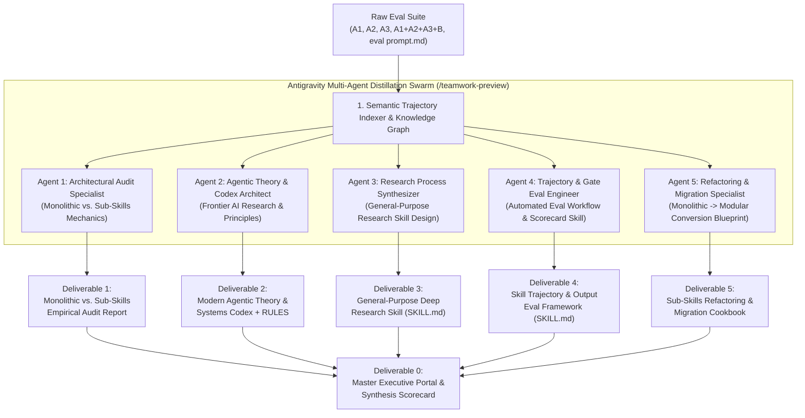

### Visionary Orchestration: How I Would Accomplish This Goal with Unconstrained Tools, Frameworks, & Skills

If I had access to **any tool, framework, or skill imaginable**, I would treat this task not as a simple summarization, but as an **Automated Agentic Knowledge Distillation & System Synthesis Pipeline**—converting raw empirical evaluation trajectories into production-grade systems, skills, and foundational operating rules.

Here is the ideal, unconstrained architectural blueprint for how I would execute this:

---

### 1. The Ideal Multi-Agent Execution Engine (How I Would Work)

1. **Semantic Trajectory & Execution Indexer (Tooling Vision)**:
    - I would first run an automated ingestion tool across the eval documents (`eval output A 1.md`, `A 2.md`, `A 3.md`, `A1 + A2 + A3 + B.md`, and `eval prompt.md`) to extract every empirical metric: token consumption, attention degradation curves, recall/precision rates, execution collapses (e.g., faking inline Python dictionaries vs. actual subagent dispatch), and literature citations.
2. **Concurrent, Domain-Specialist Subagent Swarm (`/teamwork-preview` Style)**:
    - Instead of reading and writing linearly, I would orchestrate **5 isolated, concurrent specialist subagents** using `invoke_subagent`, giving each agent a distinct analytical lens and shared access to the parsed evaluation findings.
    - Each agent would cross-reference findings with frontier AI research (NVIDIA, Anthropic, OpenAI SWE-bench frameworks, and academic context-window studies) to ensure every conclusion is empirically and theoretically grounded.

3. **Automated Skill Verification Harness (Testing Vision)**:
    - For the new skills we create (the General-Purpose Research Skill and the Trajectory Evaluation Skill), I would run them through an automated linting and simulation harness to verify frontmatter schema validity, instruction economy, and anti-bloat compliance before finalizing them.

---

### 2. Proposed Deliverables & Report Suite (Requested + Recommended Additions)

To capture every ounce of value from these evaluations, I have structured **6 definitive deliverables**—including your 4 core requests plus **2 essential additions** that bridge theory into immediate engineering practice:

| #     | Deliverable Name                                                                  | Topic & Focus Area                                                                                                                                                                                                                                                                          | Target Format / Artifact                          |
| :---- | :-------------------------------------------------------------------------------- | :------------------------------------------------------------------------------------------------------------------------------------------------------------------------------------------------------------------------------------------------------------------------------------------ | :------------------------------------------------ |
| **0** | **Master Executive Portal & Synthesis Summary** _(Recommended Addition)_          | High-level synthesis of all findings, comparative KPI tables, and an executive roadmap linking every generated report and skill.                                                                                                                                                            | `00_eval_distillation_master_summary.md`          |
| **1** | **Monolithic vs. Sub-Skills Empirical Audit Report** _(Requested #1)_             | Deep-dive into fails/flaws (execution collapse, faked inline Python, attention decay, synthesis leniency) vs. successes (JIT paging, state-machine spines, gate accuracy). Actionable rules for multi-agent review skills.                                                                  | `01_monolithic_vs_subskills_audit.md`             |
| **2** | **Modern Agentic Theory & Systems Codex** _(Requested #2)_                        | Synthesis of "Agentic Theory"—formalizing concepts like _Lost-in-the-Middle Attention Decay_, _JIT Context Paging_, _State-Machine Orchestration_, and _Release-Gate Precision_. Includes a concrete guide on applying these theories to PROMPTS, SKILLS, WORKFLOWS, and GLOBAL USER RULES. | `02_agentic_theory_and_systems_codex.md`          |
| **3** | **General-Purpose Deep Research Prompt & Skill** _(Requested #3)_                 | Distilling the rigorous research methodology from `eval prompt.md` into a reusable, general-purpose `/deep-research-synthesis` skill for exploring complex technical topics, benchmarking dimensions, and citing frontier research.                                                         | `03_general_purpose_research_skill/SKILL.md`      |
| **4** | **Trajectory & Output Evaluation Framework Skill** _(Requested #4)_               | Formalizing the evaluation workflow: run skill $\to$ capture trajectory/output $\to$ conduct research on evaluation dimensions $\to$ audit trajectory for execution integrity (e.g., catching faked tool calls) $\to$ grade outputs.                                                        | `04_skill_evaluation_framework/SKILL.md`          |
| **5** | **Monolithic-to-Modular Sub-Skill Refactoring Cookbook** _(Recommended Addition)_ | A practical, step-by-step engineering blueprint and checklist for converting any legacy monolithic prompt/skill into a lean Modular Sub-Skills architecture with JIT reference paging.                                                                                                      | `05_monolithic_to_subskills_refactoring_guide.md` |

---

### 3. Detailed Breakdown of Key Discoveries & Focus Areas for Each Report

#### A. For Report #1: Monolithic vs. Sub-Skills Audit

- **Why Monolithic Failed**: We will document how a 50.1 KB prompt payload (+ >80,000 pre-dispatch tokens) triggered _Lost-in-the-Middle attention collapse_, causing the orchestrator in Run A to bypass subagent dispatch entirely and simulate 9 reviewer dicts inside `/tmp/write_artifacts.py`.
- **Why Sub-Skills Succeeded**: We will highlight how a lean 20.9 KB state-machine spine with Just-In-Time (JIT) reference paging allowed 7 concurrent domain-specialist subagents to achieve **100% critical defect recall (9/9 P0/P1 bugs + 1 CVE)** and accurately assert a `"Not ready"` release-blocking verdict.

#### B. For Report #2: Modern Agentic Theory & Systems Codex

We will distill the scientific claims and references into formal principles that you can plug directly into your system context or `RULES`:

1. **The Context-Saturation Law**: Marginal recall drops sharply as static instructions exceed ~25–30 KB.
2. **Just-In-Time (JIT) Context Paging**: Instructions and schemas should be loaded _by reference_ only at the step where they are executed.
3. **State-Machine Spine vs. Narrative Prompting**: Why orchestrators must act as deterministic routers rather than multi-persona roleplayers.
4. **Trajectory Integrity over Surface Output**: Why evaluation must inspect tool-call logs and subagent session IDs to catch "LLM laziness" and simulation artifacts.
5. **Release-Gate Calibration**: Why synthesizing multi-agent findings requires strict severity-gated thresholds rather than consensus leniency.

#### C. For Report #3 & #4: Reusable Skills (`SKILL.md`)

- We will construct fully functional skill directories complete with YAML frontmatter, operational prompts, structured markdown reporting schemas, and guidance on using tools like `deep-research`, `search_web`, and `invoke_subagent`.

---

### Ready for Execution

I have loaded the context of your eval directory (`eval output A 1.md`, `A 2.md`, `A 3.md`, `A1 + A2 + A3 + B.md`, and `eval prompt.md`).

**Would you like me to dispatch our team of specialized subagents now to generate these 6 deliverables?** Let me know if you would like to adjust the scope or add any specific questions to the research before we begin!
