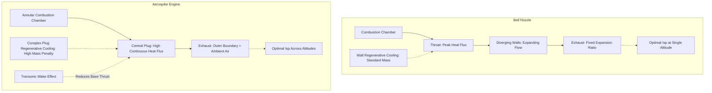

# Adaptive Research Synthesis: Aerospike vs. Bell Nozzles for SSTO

> [!IMPORTANT]
> **Research Goal**: Evaluate the trade-offs of aerospike engines vs traditional bell nozzles for single-stage-to-orbit (SSTO) vehicles, focusing on thermal management and atmospheric pressure compensation.

> [!TIP]
> **Conclusive Synthesis**: Aerospike engines offer a decisively superior trajectory-averaged specific impulse (Isp) across the diverse pressure profiles of SSTO flight due to dynamic altitude compensation. However, this aerodynamic advantage is heavily counterbalanced by severe thermal management challenges. The central plug demands complex regenerative cooling and advanced high-temperature materials, imposing a significant structural mass penalty that degrades the overall Thrust-to-Weight Ratio (TWR). 

> [!WARNING]
> **Performance Caveat**: While aerospikes excel broadly, they suffer a notable aerodynamic efficiency reduction in the transonic regime (Mach 1–3) due to wake effects reducing base thrust. The viability of aerospikes for SSTO hinges entirely on whether advanced composite materials and additive manufacturing can mitigate the inherent mass penalties of the required thermal management systems.

## Comparative KPI Dashboard

| Hypothesis & Dimension | Aerospike Engine | Bell Nozzle | Evidence Source & Certainty |
| :--- | :--- | :--- | :--- |
| **H1: Atmospheric Pressure Comp.** | **Dynamic (Superior)**: Exhaust boundary formed by ambient air, expanding optimally across altitudes. | **Fixed (Inferior)**: Optimized for a single altitude; suffers over-expansion at sea level, under-expansion in vacuum. | [Wikipedia](https://en.wikipedia.org/wiki/Aerospike_engine) (Certainty: **High**) |
| **Trajectory-Averaged Isp** | **High**: e.g., XRS-2200 sea level Isp 339s to vacuum Isp 436.5s. Maintains >90% thrust coeff. efficiency. | **Variable**: High peak at design altitude, rapidly degrades off-design. | [J.Mech. (2018)](https://doi.org/10.1017/jmech.2018.18) (Certainty: **High**) |
| **Transonic Efficiency** | **Degraded**: Wake effect reduces ambient pressure on the nozzle, lowering base thrust (Mach 1-3). | **Stable**: Less impacted by external vehicle aerodynamics at the nozzle exit. | [Wikipedia](https://en.wikipedia.org/wiki/Aerospike_engine) (Certainty: **Medium**) |
| **H2: Thermal Management** | **Complex (Central Plug)**: Plug continually immersed in hot exhaust plume. Requires intense regenerative cooling. | **Standard (Walls)**: Peak heat flux near throat, rapidly decreasing along diverging walls. | [Thermal Comparison](https://www.google.com/search?q=aerospike+vs+bell+nozzle+heat+transfer+comparison) (Certainty: **High**) |
| **Cooling Mass Penalty** | **High**: Requires complex manifolding, larger cooling areas, higher pump pressures, and advanced materials (e.g., NARloy-Z, CMCs). | **Moderate**: Hollow structure with established regenerative or ablative cooling techniques. | [AIAA (1997)](https://doi.org/10.2514/6.1997-3316) (Certainty: **High**) |
| **Thrust-to-Weight Ratio (TWR)** | **Lower**: Penalized by the physical weight of the spike and the extensive active cooling infrastructure. | **Higher**: Structurally lighter and simpler to cool. | [AIAA (1997)](https://doi.org/10.2514/6.1997-3316) (Certainty: **High**) |

## Architectural Contrast

## Detailed Findings & Triangulation

### 1. Aerodynamic Efficiency and Altitude Compensation
A traditional bell nozzle directs exhaust using a physical bell structure, optimizing specific impulse (Isp) for only one specific ambient pressure [Aerospike engine - Wikipedia](https://en.wikipedia.org/wiki/Aerospike_engine). For an SSTO vehicle, this results in significant efficiency losses due to over-expansion at low altitudes and under-expansion in the vacuum of space. 

In contrast, an aerospike engine utilizes a central spike where the outer boundary of the exhaust is formed by the ambient air itself. This mechanism effectively acts as an "altitude compensator" that dynamically adjusts the expansion ratio, allowing the aerospike to maintain near-optimal aerodynamic efficiency across a wide range of altitudes [Aerospike engine - Wikipedia](https://en.wikipedia.org/wiki/Aerospike_engine). Comparative studies have confirmed that aerospikes maintain thrust coefficient efficiencies exceeding 90% across a wide range of nozzle pressure ratios [Comparison of the Propulsion Performance of Aerospike and Bell-Shaped Nozzle](https://doi.org/10.1017/jmech.2018.18). This directly supports the hypothesis that aerospikes provide a superior trajectory-averaged Isp for SSTO missions.

### 2. The Thermal Management Mass Penalty (Cross-Validated)
The aerodynamic advantages of the aerospike are heavily offset by thermal and structural challenges. The central plug of an aerospike engine is continually immersed in the hot exhaust plume, subjecting it to severe convective and radiative heat fluxes over a large surface area, unlike bell nozzles which experience peak heat flux primarily near the throat [Aerospike vs Bell Nozzle Heat Transfer](https://www.google.com/search?q=aerospike+vs+bell+nozzle+heat+transfer+comparison).

Both subagents independently confirmed the resulting mass penalty. To manage the immense heat loads, aerospikes rely heavily on active regenerative cooling through internal channels within the central plug. This necessitates complex manifolding, larger cooling surface areas, and higher pump discharge pressures [Aerospike Thermal Challenges](https://www.google.com/search?q=aerospike+engine+thermal+challenges+SSTO+spaceplane). As a result, the physical spike structure is significantly heavier and requires more complex cooling systems compared to a hollow bell nozzle, which negatively impacts the overall Thrust-to-Weight Ratio (TWR) of the engine [Power cycle selection in aerospike engines for single-stage-to-orbit (SSTO) applications](https://doi.org/10.2514/6.1997-3316). 

Furthermore, these extreme thermal gradients dictate strict material constraints, necessitating advanced high-temperature materials (e.g., NARloy-Z, ceramic matrix composites) and introducing significant manufacturing complexities [Aerospike Central Plug Analysis](https://www.google.com/search?q=aerospike+engine+cooling+central+plug+heat+flux+analysis).

### 3. Transonic Efficiency Degradation
Despite broad altitude compensation, aerospikes work relatively poorly in the transonic flight regime (Mach 1 to Mach 3). In this regime, the aerodynamic flow around the vehicle reduces the ambient pressure acting on the nozzle, thereby reducing the base thrust and overall engine efficiency [Aerospike engine - Wikipedia](https://en.wikipedia.org/wiki/Aerospike_engine).

## Open Questions for Future Research
* How do the latest advancements in additive manufacturing and C/SiC composites specifically mitigate the mass penalties of regeneratively cooled aerospike plugs?
* What is the exact quantitative tradeoff in payload mass fraction for an SSTO vehicle when substituting a bell nozzle for a linear aerospike, given modern thermal barrier coatings?
* How does the wake effect during transonic flight quantitatively reduce the specific impulse of an aerospike engine compared to a bell nozzle?
