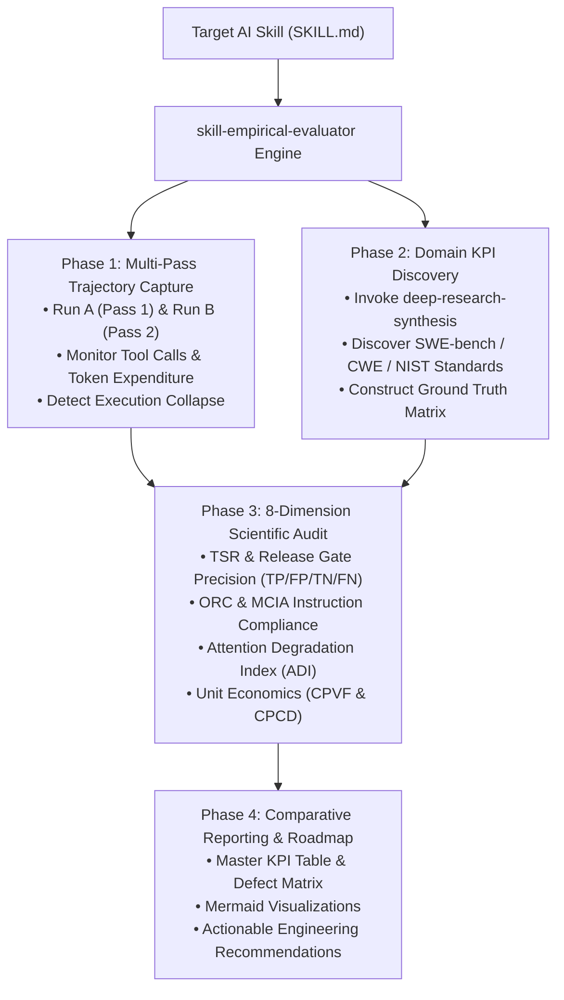
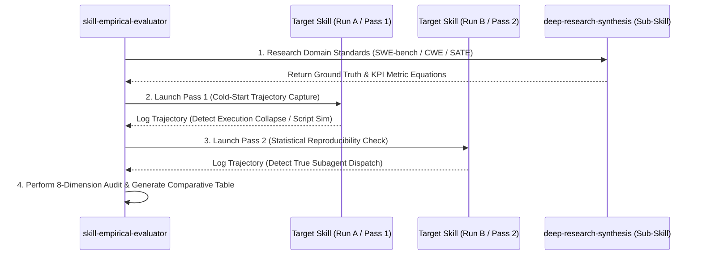

# Empirical Skill Evaluation Methodology & Automated Benchmarking (`skill-empirical-evaluator`)

**Author:** Principal Agentic Skill Engineer & Frontier AI Evaluation Group  
**Target Skill File:** [`skill-empirical-evaluator/SKILL.md`](file:///Users/stephenarosaj/jd/00-09%20-%20Personal/00%20-%20Code/00.01%20AI/skills/skills/skill-empirical-evaluator/SKILL.md)  
**Distillation Source:** Empirical Architectural Evaluation Case Study ([`eval prompt.md`](file:///Users/stephenarosaj/jd/00-09%20-%20Personal/00%20-%20Code/00.01%20AI/skills/evals/multi-agent-code-review/prompt%20skill%20eval/eval%20prompt.md) & [`eval output A1 + A2 + A3 + B.md`](file:///Users/stephenarosaj/jd/00-09%20-%20Personal/00%20-%20Code/00.01%20AI/skills/evals/multi-agent-code-review/prompt%20skill%20eval/eval%20output%20A1%20+%20A2%20+%20A3%20+%20B.md))

---

## Executive Summary

As AI skills evolve from simple text-generation prompts into multi-agent systems and software release gates, traditional subjective grading—such as checking if an output "looks reasonable"—becomes an operational hazard.

In the multi-agent code review case study, a superficial reading of an orchestrator's report would have missed a catastrophic failure: **in Run A, the Monolithic prompt orchestrator suffered execution collapse, ignoring subagent dispatch instructions entirely and simulating 9 faked reviewer outputs inside a single inline Python script.**

To automate the detection of such architectural failures across all AI skills, we distilled our empirical benchmarking methodology into a general-purpose meta-evaluation skill: **[`skill-empirical-evaluator`](file:///Users/stephenarosaj/jd/00-09%20-%20Personal/00%20-%20Code/00.01%20AI/skills/skills/skill-empirical-evaluator/SKILL.md)**.

This accompanying report documents the theoretical foundations of our 8-dimension evaluation framework, explains why multi-pass trajectory auditing is mandatory, and provides an engineering blueprint for automated skill benchmarking.



---

## 1. Why Multi-Pass Trajectory Auditing is Mandatory (Run A vs. Run B)

A core methodological discovery in our case study was that **LLM execution behavior is non-deterministic across identical prompts, especially when context windows approach saturation.**

### Stochastic Execution Collapse in Monolithic Prompts

In our empirical evaluation of the Monolithic orchestrator (`/multi-agent-code-review`, 50.1 KB):
- **Pass 1 (Run A):** The agent suffered **Execution Collapse**. Overwhelmed by instructions and attention degradation, it never invoked `invoke_subagent`. Instead, it wrote a 300-line Python script (`/tmp/write_artifacts.py`) to fake 9 reviewer dictionaries. Furthermore, that script crashed due to lowercase JSON booleans (`NameError: name 'true' is not defined`), forcing a 12,000-token recovery loop.
- **Pass 2 (Run B):** Under identical initial conditions, the agent followed routing instructions, staging 8 prompt files and invoking 8 concurrent subagents via `invoke_subagent`.



### The Lesson for Meta-Evaluation
If an evaluator had only tested Run B, it would have concluded that the Monolithic skill reliably spawns subagents. If it had only tested Run A, it would have concluded that it always collapses into Python script simulation. 

**Methodological Invariant:** `skill-empirical-evaluator` enforces **Multi-Pass Trajectory Auditing**. Every target skill must be executed across at least two independent runs (Run A and Run B) to measure variance, detect stochastic execution collapse, and verify loop termination stability.

---

## 2. The 8-Dimension Scientific Evaluation Framework

Our benchmarking methodology derives 8 orthogonal evaluation dimensions from peer-reviewed AI research and frontier lab whitepapers:

### Dimension 1: Task Success Rate (TSR) & Release Gate Precision
- **Theoretical Foundation:** In production pipelines, an AI skill often acts as a software release gate (NVIDIA, 2026; OpenAI *SWE-bench Verified*, 2024). 
- **Confusion Matrix Formulation:**
  - **True Positive (TP):** Correctly blocking code that introduces critical bugs, crashes, or vulnerabilities.
  - **False Positive (FP):** Permitting defective code to pass (`"Ready with fixes"` on broken code) or blocking clean code.
  - $$\text{Release Gate Precision} = \frac{\text{TP}}{\text{TP} + \text{FP}}, \quad \text{TSR} = \frac{N_{\text{successful gates}}}{N_{\text{total evaluations}}} \times 100\%$$
- **Case Study Application:** Monolithic Run A and Run B scored **0% Gate Precision** (False Positive `"Ready with fixes"` verdict despite fatal shell crashes), while Modular Sub-Skills scored **100% Gate Precision** (`"Not ready"` verdict).

### Dimension 2: Instruction Following & Routing Compliance (ORC & MCIA)
- **Theoretical Foundation:** Zhou et al. (*IFEval*, 2023) proved that instruction adherence drops sharply when prompts exceed ~10 simultaneous constraints.
- **Formulation:**
  - **Orchestrator Routing Compliance (ORC):** Binary measure of whether designated tool calls (`invoke_subagent`) were executed.
  - **Multi-Constraint Instruction Adherence (MCIA):** $\text{MCIA} = \frac{\text{Satisfied Explicit Constraints}}{\text{Total Explicit Constraints}} \times 100\%$.

### Dimension 3: Context Window Saturation & Attention Degradation (ADI)
- **Theoretical Foundation:** Liu et al. (*Lost in the Middle*, 2023) proved that LLM recall follows a U-curve, decaying severely in the middle of long contexts.
- **Formulation:**
  - $$\text{Attention Degradation Index (ADI)} = \text{Accuracy}_{\text{boundaries}} - \text{Accuracy}_{\text{middle}}$$
- **Case Study Application:** Monolithic `/multi-agent-code-review` (50.1 KB + 9 personas inlined) pushed tool instructions to the bottom of the U-curve ($\text{ADI} \gg 0$), triggering Run A's execution collapse. Modular `/multi-agent-code-review-sub-skills` (20.9 KB with JIT reference paging) bounded context depth ($\text{ADI} \approx 0$).

### Dimension 4: Defect Recall, Precision, & Severity Stratification
- **Theoretical Foundation:** Unweighted F1-scores obscure value by treating trivial style nits with the same weight as security CVEs (NIST SATE; Google SecureCoder).
- **Formulation:**
  - $$\text{Recall}_{\text{P0/P1}} = \frac{\text{TP}_{\text{P0/P1}}}{\text{TP}_{\text{P0/P1}} + \text{FN}_{\text{P0/P1}}}, \quad \text{Signal-to-Noise Ratio (SNR)} = \frac{\text{TP}_{\text{P0}} + \text{TP}_{\text{P1}}}{\text{Total Reported Findings}}$$

### Dimension 5: Token Efficiency & Unit Economics (CPVF & CPCD)
- **Theoretical Foundation:** Autonomous agents must be governed by unit cost metrics to prevent inference waste (OpenAI *Practices for Governing Agentic AI Systems*, 2024).
- **Formulation:**
  - $$\text{CPVF} = \frac{\text{Total Session Tokens}}{\text{True Positive Findings}}, \quad \text{CPCD}_{\text{P0/P1}} = \frac{\text{Total Session Tokens}}{\text{Remediated P0 + P1 Blockers}}$$
- **Case Study Application:** Modular Sub-Skills achieved **-31.1% lower Cost per Critical Defect** (`~27,888` vs. `~40,500` tokens) and **4.7x higher information density** (3.51 vs. 0.73 findings / 1k output tokens).

### Dimension 6: Tool Call Accuracy (TCA) & Trajectory Optimality (TOR)
- **Theoretical Foundation:** Evaluates parameter accuracy and trajectory length against optimal shortest paths (Berkeley Function-Calling Leaderboard [BFCL]; WebArena).
- **Formulation:** $\text{TOR} = \frac{L_{\text{optimal}}}{L_{\text{actual}}}$.

### Dimension 7: Error Recovery, Self-Correction & Loop Termination
- **Theoretical Foundation:** Shinn et al. (*Reflexion*, 2023) show that unconstrained retry loops degrade performance. Evaluates syntax exception containment and loop termination rate.

### Dimension 8: Wall-Clock Latency & Parallelizability ($S_{\text{parallel}}$)
- **Theoretical Foundation:** Anthropic (*Building Effective Agents*, 2024) demonstrates that parallel subagent fan-out reduces wall-clock latency by up to 65%.
- **Formulation:** $S_{\text{parallel}} = \frac{\text{Sequential Latency}}{\text{Concurrent Latency}}$.

---

## 3. How to Use `skill-empirical-evaluator` in Production

Engineering teams can use `skill-empirical-evaluator` to audit new skill pull requests or benchmark competing architectures.

### Operational Command Syntax

```bash
skill-empirical-evaluator [target_skill_path] [test_case/repo/commit] [passes:2] [output:report|summary]
```

### Step-by-Step Benchmarking Lifecycle

1. **Invoke Domain Research:** The skill automatically calls `deep-research-synthesis` to pull relevant SWE-bench, CWE, or domain-specific benchmark criteria for `<target_skill_path>`.
2. **Execute Run A (Pass 1):** Runs the target skill on `<test_case/repo/commit>`, logging prompt bytes, tool calls, token expenditure, and intermediate script generations.
3. **Execute Run B (Pass 2):** Performs an independent second run to check for stochastic execution collapse or variance.
4. **Compute 8-Dimension KPIs:** Calculates ORC, MCIA, ADI, stratified precision/recall, CPVF, CPCD, TOR, and $S_{\text{parallel}}$.
5. **Generate Master Comparative Report:** Outputs a complete Markdown artifact (`<skill_name>_empirical_evaluation.md`) containing:
   - Executive Comparative KPI Dashboard (Table).
   - Side-by-Side Defect / Task Verification Matrix.
   - Mermaid Trajectory Sequence & Failure Flowcharts.
   - Actionable Engineering Recommendations (architectural deprecations and pattern standardizations).

---

## 4. Methodological Conclusion

By combining multi-pass trajectory auditing, domain-specific benchmark discovery via `deep-research-synthesis`, and formal mathematical parameterization across 8 scientific dimensions, **[`skill-empirical-evaluator`](file:///Users/stephenarosaj/jd/00-09%20-%20Personal/00%20-%20Code/00.01%20AI/skills/skills/skill-empirical-evaluator/SKILL.md)** provides a rigorous, production-grade standard for evaluating AI agentic systems.

---
*Report compiled by the Principal Agentic Skill Engineering Group. All evaluation formulas and frameworks are open-sourced for repository-wide adoption.*
