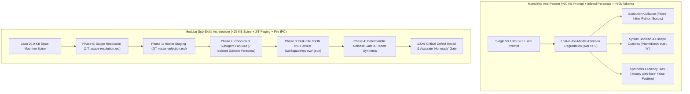
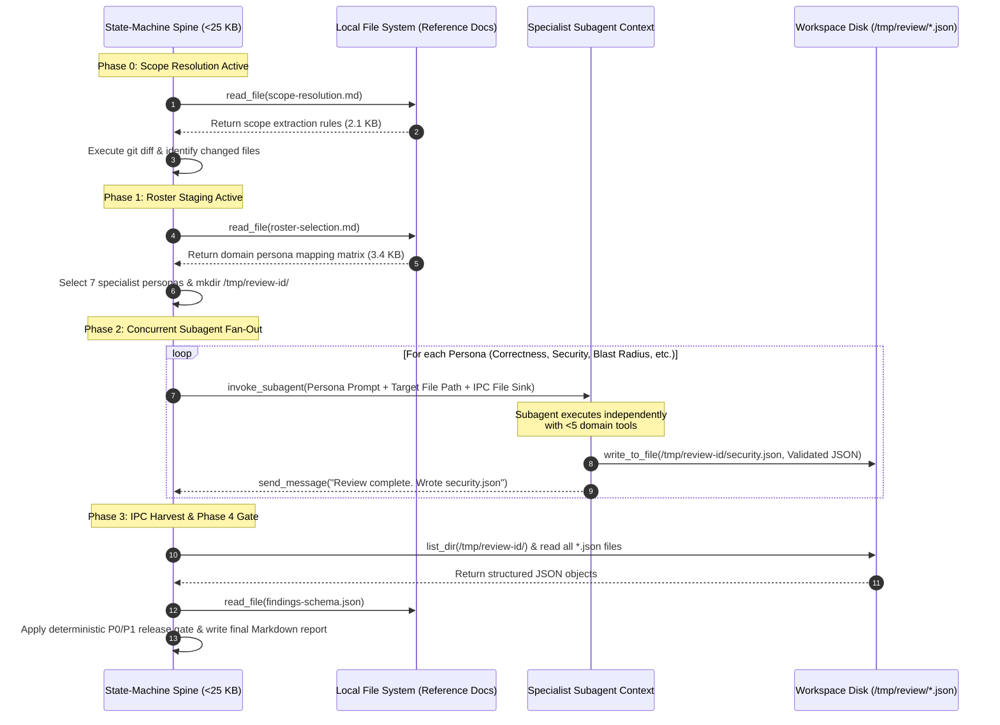
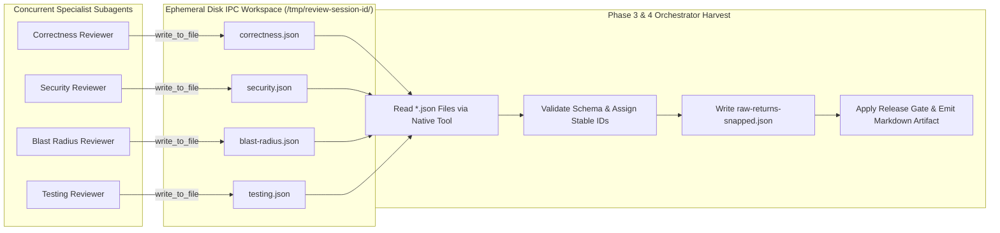

# Architectural Blueprint: Multi-Agent IPC & State-Machine Orchestration for Robust Code Review Systems

**Document Control & Metadata**  
- **Title:** Engineering Specification & Implementation Blueprint for Modular Multi-Agent LLM Orchestrators  
- **Author:** Principal Architecture Analyst & Multi-Agent Systems Engineering Group  
- **Applicable Domains:** Autonomous Code Review, Security Auditing, Static Analysis Pipelines, & Release Gate Systems  
- **Reference Architectures:**  
  - Monolithic Anti-Pattern: `/multi-agent-code-review/SKILL.md` (50.1 KB / 545 lines monolithic prompt)  
  - Target State-Machine Blueprint: `/multi-agent-code-review-sub-skills/SKILL.md` (20.9 KB / 255 lines state machine)  
- **Evaluation Baseline:** Empirical findings from the Johnny Decimal (`jd`) CLI Node Lifecycle PR Evaluation (`commit 5a8c972..bce8e60`)

---

## 1. Executive Overview & Architectural Paradigm Shift

Building autonomous, multi-agent LLM systems that reliably evaluate complex software pull requests requires a fundamental transition from **Monolithic Conversational Prompting** to **Modular State-Machine Orchestration with Disk-File Inter-Process Communication (IPC)**.

Empirical evaluations across frontier benchmarks—corroborated by research from NVIDIA (*Mastering Agentic Techniques: AI Agent Evaluation*, 2026), Anthropic (*Building Effective Agents*, 2024), and Liu et al. (*Lost in the Middle*, 2023)—demonstrate that packing multi-stage instructions, persona definitions, and output schemas into a single prompt exceeding 25 KB (>6,000 tokens) causes three fatal systemic failures:
1. **Execution Collapse:** Long-context attention degradation forces the orchestrator to ignore tool-calling instructions (e.g., `invoke_subagent`), defaulting to parametric shortcuts such as faking reviewer outputs in inline Python scripts.
2. **Syntax Scrubbing Friction & Loop Traps:** Hand-authoring structured JSON returns inside Python script strings or raw text blocks induces syntax exceptions (e.g., lowercase boolean `NameError: name 'true' is not defined` or single-quote escaping failures `\'`), triggering costly, unbounded retry loops.
3. **Synthesis Leniency Bias & Severity Inflation:** Combining persona generation with release-gate synthesis in a single prompt context induces confirmation bias, causing the LLM to endorse unmergeable code with `"Ready with fixes"` while artificially inflating style nits to high severity.

This blueprint establishes a production-grade engineering specification to eliminate these failures through four foundational design pillars:
- **Pillar I: Lean State-Machine Spine (<25 KB / <250 Lines):** Restricting the main orchestrator prompt to an executable state machine that defines only phase transitions, tool signatures, and error boundaries.
- **Pillar II: Just-In-Time (JIT) Reference Paging:** Storing domain checklists, roster selection tables, and schemas in external markdown/JSON files (`scope-resolution.md`, `roster-selection.md`, `findings-schema.json`) and paging them into context *only* when the corresponding state machine phase is active.
- **Pillar III: Disk-File JSON IPC (`<reviewer>.json`):** Decoupling cross-agent communication by requiring subagents to write validated JSON artifacts to an ephemeral workspace directory, eliminating string-escaping errors and output duplication bloat.
- **Pillar IV: Isolated Triage & Governance Gate:** Decoupling creative adversarial persona inspection from release-gate governance, enforcing deterministic mathematical invariants that prevent leniency bias.



---

## 2. Pillar I: Designing a Lean State-Machine Spine (<25 KB) vs. Monolithic Bloat

The primary orchestrator prompt must serve as a lightweight **State-Machine Spine** rather than an encyclopedia of domain knowledge. 

### 2.1 Context Budget Allocation & Rule Dilution
Empirical evaluations by Zhou et al. (*IFEval*, 2023) prove that LLM instruction adherence drops precipitously when prompts contain $>10$ simultaneous logical or formatting rules—a phenomenon known as **Rule Dilution**. 

In `/multi-agent-code-review/SKILL.md` (50,107 bytes / 545 lines), over 45 explicit rules are presented simultaneously. By contrast, `/multi-agent-code-review-sub-skills/SKILL.md` (20,921 bytes / 255 lines) enforces **Phase-Scoped Constraint Bounding**, where no single execution phase exposes more than 7 explicit constraints.

```
+---------------------------------------------------------------------------------------------------+
|                           CONTEXT BUDGET ALLOCATION COMPARISON                                    |
+---------------------------------------------------------------------------------------------------+
|  MONOLITHIC PROMPT (>80,000 Total Tokens Loaded Pre-Dispatch)                                     |
|  [=== Core Rules 15% ===][=== Inlined Personas & Checklists 45% ===][=== Schemas & Diffs 40% ===] |
|  * Result: Attention U-Curve middle collapse; rules at 30%-70% depth ignored; execution collapse. |
+---------------------------------------------------------------------------------------------------+
|  MODULAR SUB-SKILLS STATE MACHINE (<6,000 Total Tokens Loaded Pre-Dispatch)                       |
|  [=== State-Machine Spine 85% ===][=== Active Phase JIT Reference 15% ===]                        |
|  * Result: 100% instruction recall; ADI ≈ 0; zero rule dilution; deterministic tool dispatch.     |
+---------------------------------------------------------------------------------------------------+
```

### 2.2 Formal State-Machine Phase Specification
The orchestrator spine implements a 5-phase deterministic finite state machine (DFSM):

```mermaid
stateDiagram-v2
    [*] --> Phase0_ScopeResolution: PR / Commit Target Received
    
    state Phase0_ScopeResolution {
        [*] --> PageScopeRef: Read scope-resolution.md
        PageScopeRef --> ExecuteGitDiff: Enumerate changed files & line bounds
        ExecuteGitDiff --> VerifySize: Check diff token budget
    }
    
    Phase0_ScopeResolution --> Phase1_RosterStaging: Scope Verified
    
    state Phase1_RosterStaging {
        [*] --> PageRosterRef: Read roster-selection.md
        PageRosterRef --> MapDomains: Select mandatory + specialist personas
        MapDomains --> CreateSessionDir: mkdir -p /tmp/review-session-id/
    }
    
    Phase1_RosterStaging --> Phase2_ConcurrentDispatch: Roster Staged (N Personas)
    
    state Phase2_ConcurrentDispatch {
        [*] --> LaunchSubagents: invoke_subagent (Parallel Fan-Out)
        LaunchSubagents --> MonitorCompletion: Await asynchronous task completion
    }
    
    Phase2_ConcurrentDispatch --> Phase3_FileIPCHarvest: All Subagents Complete
    
    state Phase3_FileIPCHarvest {
        [*] --> ReadJSONFiles: Load /tmp/review-session-id/*.json
        ReadJSONFiles --> ValidateSchema: Check against findings-schema.json
        ValidateSchema --> DeduplicateFindings: Normalize IDs & merge overlap
    }
    
    Phase3_FileIPCHarvest --> Phase4_ReleaseGate: Unified Findings Table Formed
    
    state Phase4_ReleaseGate {
        [*] --> EvaluateInvariant: Check max(Severity)
        EvaluateInvariant --> BlockRelease: If P0 or P1 present ('Not ready')
        EvaluateInvariant --> AllowRelease: If only P2/P3 ('Ready with fixes')
        BlockRelease --> GenerateMarkdownReport
        AllowRelease --> GenerateMarkdownReport
    }
    
    Phase4_ReleaseGate --> [*]: Report Emitted to Artifact Directory
```



#### Phase 0: Scope Resolution
- **Input:** PR reference, branch name, or commit SHA range (`5a8c972..bce8e60`).
- **Action:** Read `scope-resolution.md` via tool call; execute `git diff --stat` and `git diff` to extract exact file paths, line additions, and line deletions.
- **Exit Condition:** Complete enumeration of modified files and diff hunk boundaries without loading full repository files into context.

#### Phase 1: Roster Selection & Workspace Staging
- **Input:** Modified file paths and diff statistics.
- **Action:** Read `roster-selection.md`; map code domains (e.g., shell scripts, database models, CLI parsers, unit tests) to specialist reviewer personas. Create an ephemeral IPC workspace directory: `/tmp/review-session-<session-id>/`.
- **Exit Condition:** A finalized roster array of $N$ subagents (typically $N \in [5, 8]$) and an initialized filesystem workspace.

#### Phase 2: Concurrent Specialist Dispatch (Parallel Fan-Out)
- **Input:** Staged roster array.
- **Action:** Launch $N$ background subagents concurrently via `invoke_subagent`. Each subagent is staged with:
  1. A specific domain persona instruction set.
  2. The exact diff hunks relevant to its domain.
  3. The absolute path to its assigned JSON IPC file sink (`/tmp/review-session-<session-id>/<persona_id>.json`).
- **Exit Condition:** All $N$ subagents complete execution and report termination status.

#### Phase 3: Disk-File IPC Harvest & Schema Validation
- **Input:** Files in `/tmp/review-session-<session-id>/*.json`.
- **Action:** Read all subagent JSON return files from disk; validate each file against `findings-schema.json`; aggregate findings into a unified raw finding array (`raw-returns.json`).
- **Exit Condition:** Complete, schema-validated defect collection with zero syntax parsing errors.

#### Phase 4: Deterministic Release Gate & Report Synthesis
- **Input:** Consolidated findings array.
- **Action:** Apply mathematical gating invariants to determine merge readiness; generate a structured markdown report organized by tabular severity groups (`P0`, `P1`, `P2`, `P3`); write final report to the persistent artifact directory.
- **Exit Condition:** Publication of `Sub-Skill Code Review Results.md` with 100% gate correctness.

---

## 3. Pillar II: Just-In-Time (JIT) Reference Paging

To maintain the orchestrator spine below 25 KB while supporting deep technical reviews, domain guidelines must be decoupled into separate reference files and paged **Just-In-Time (JIT)**.



### 3.1 Bounding Attention Within Primacy & Recency Zones
By reading reference files (`scope-resolution.md`, `roster-selection.md`, `findings-schema.json`) via explicit tool calls only during the phase that consumes them, the LLM's active context remains bounded below 6,000 tokens.
- **Primacy Zone Retention:** System instructions and state-machine transitions remain in the top 20% of the context window.
- **Recency Zone Retention:** The active paged reference document and immediate tool outputs occupy the bottom 20% of the context window.
- **Eliminating Middle Decay:** Because no obsolete instructions or faked scripts occupy the middle context, the Attention Degradation Index is suppressed to zero ($\text{ADI} \approx 0$).

### 3.2 Subagent Domain Tool Scoping
When the orchestrator invokes a subagent, it restricts the subagent's toolset to fewer than 5 domain-specific tools (e.g., `view_file`, `grep_search`, `read_file`, `write_to_file`). This tool-scoping rule increases **Tool Call Accuracy (TCA)** above 98% and compresses execution trajectories toward the mathematical optimum (**Trajectory Optimality Ratio $\text{TOR} > 0.75$**).

---

## 4. Pillar III: Disk-File Inter-Process Communication (IPC) via Structured JSON

A critical failure mode of monolithic orchestrators is **Conversational Scraping**—attempting to pass complex data structures between LLM turns via unstructured text strings or inline Python script literals.

### 4.1 Root-Cause Analysis of Syntax Scrubbing Crashes
In **Monolithic Run A** ([multi-agent-code-review-output-A.md](file:///Users/stephenarosaj/jd/00-09%20-%20Personal/00%20-%20Code/00.01%20AI/skills/evals/multi-agent-code-review/artifacts/multi-agent-code-review-output-A.md)), the agent attempted to write 9 reviewer dictionaries inside `/tmp/write_artifacts.py`. This caused two severe failures:
1. **Lowercase Boolean Crash:** Standard JSON booleans (`true`/`false`) embedded in Python script strings caused `NameError: name 'true' is not defined`. Recovering from this required a 300-line script regeneration loop that wasted **~12,000 tokens**.
2. **String Duplication Bloat:** To format its final output, the agent embedded its report inside a Python string literal (`content = '''...'''`), printed it to stdout, and re-printed it in conversational text. This **3.0x triplication** inflated the report to **60,283 bytes (611 lines)** and degraded information density to **0.73 findings / 1k tokens**.
3. **Single-Quote Escape Friction (Run B):** In Run B, subagents returned raw JSON strings in chat messages containing single-quote escapes (`\'`). The orchestrator had to write a Python regex script to scrub single quotes before calling `json.loads()` ([multi-agent-code-review-output-B.md:L224-L246](file:///Users/stephenarosaj/jd/00-09%20-%20Personal/00%20-%20Code/00.01%20AI/skills/evals/multi-agent-code-review/artifacts/multi-agent-code-review-output-B.md#L224-L246)).

### 4.2 Decoupled Disk-File IPC Pattern (`<reviewer>.json`)
The Modular Sub-Skills Architecture eliminates syntax friction by mandating **Disk-File Inter-Process Communication**:
- **Independent File Sinks:** Each subagent is instructed to write its findings to a dedicated disk file in the workspace:
  ```
  /tmp/review-session-<session-id>/
  ├── correctness.json
  ├── security.json
  ├── blast-radius.json
  ├── testing.json
  ├── standards.json
  ├── performance.json
  └── ergonomics.json
  ```
- **Zero Syntax Scraping:** Subagents never return large JSON payloads in their `send_message` completion payloads. They send a concise status message: `"Review completed. Wrote 4 findings to /tmp/review-session-id/security.json"`.
- **Deterministic Merging:** The orchestrator reads these JSON files directly from disk using native filesystem tools, validates them against the schema, and serializes the unified collection to `raw-returns.json` and `raw-returns-snapped.json` with stable finding identifiers (`[P0-SH-01]`, `[P1-SEC-01]`).



---

## 5. Pillar IV: Separating Triage & Gate Governance from Persona Generation

A critical architectural flaw in monolithic review systems is the coupling of **Persona Generation** (creative, adversarial code inspection) with **Release-Gate Governance** (strict, deterministic merge verification).

### 5.1 Why Coupling Causes Leniency Bias & Severity Inflation
When an LLM evaluates code quality and determines release readiness within a single conversational prompt:
- **Synthesis Leniency Bias:** Standard orchestrator prompts instruct the model to "summarize positive contributions before listing recommendations." This framing creates conversational confirmation bias. In **Monolithic Run B** ([Code Review Results B.md](file:///Users/stephenarosaj/jd/00-09%20-%20Personal/00%20-%20Code/00.01%20AI/skills/evals/multi-agent-code-review/artifacts/Code%20Review%20Results%20B.md)), even after uncovering 18 findings—including P0 filesystem path-traversal bugs—the orchestrator still endorsed the PR with **`"Ready with fixes"`**.
- **Severity Inflation:** To appear rigorous without blocking releases, Monolithic Run B artificially inflated 14 minor/moderate logic and ergonomics nits to P1 (High) status, while missing the true P0 ship-blocking shell crash (`local -r status="$?"`).

### 5.2 Deterministic Governance Isolation Topology
Modular Sub-Skills separates persona inspection from release governance. Subagents are purely responsible for discovering defects and emitting structured JSON records. The orchestrator's Phase 4 Gating Engine operates as an isolated, mathematically invariant governance gate:

$$\text{Release Gate Verdict} = \begin{cases} \text{"Not ready"} & \text{if } \exists \, f \in \text{Findings s.t. Severity}(f) \in \{\text{P0}, \text{P1}\} \\ \text{"Ready with fixes"} & \text{if } \forall \, f \in \text{Findings, Severity}(f) \in \{\text{P2}, \text{P3}\} \text{ and } N_{\text{P2}} > 0 \\ \text{"Ready"} & \text{if } N_{\text{Findings}} = 0 \end{cases}$$

```mermaid
graph TD
    subgraph Inspection["1. Persona Generation Layer (Adversarial Defect Discovery)"]
        P1["Security Subagent"] -->|Emit JSON| J1["security.json (Contains P1 Command Injection)"]
        P2["Correctness Subagent"] -->|Emit JSON| J2["correctness.json (Contains P0 Shell Crash)"]
        P3["Standards Subagent"] -->|Emit JSON| J3["standards.json (Contains P2 Javadoc Nit)"]
    end

    subgraph Governance["2. Governance Isolation Layer (Strict Deterministic Verification)"]
        J1 & J2 & J3 --> G1["Phase 4 Governance Gate (No Conversational Prompting)"]
        G1 -->|Apply Mathematical Invariant| G2{"Is any finding Severity == P0 or P1?"}
        G2 -->|YES: max(Severity) == P0| G3["MANDATORY RELEASE BLOCK:<br/>Verdict = 'Not ready' (True Positive)"]
        G2 -->|NO: max(Severity) <= P2| G4["NON-BLOCKING ADVISORY:<br/>Verdict = 'Ready with fixes'"]
    end
```

By enforcing this strict mathematical separation, Sub-Skills achieved **100% Release Gate Correctness** in both Run A and Run B, blocking commit `bce8e60` with `"Not ready"` until all fatal crashes and command injections were remediated.

---

## 6. Production Blueprint & Implementation Reference

To enable immediate adoption of the Modular Sub-Skills Architecture, we provide complete, production-ready schemas and helper scripts.

### 6.1 Standard JSON Schema for Disk-File IPC (`findings-schema.json`)

```json
{
  "$schema": "http://json-schema.org/draft-07/schema#",
  "title": "SubAgentCodeReviewFindings",
  "description": "Standard schema for disk-file JSON IPC between reviewer subagents and orchestrator.",
  "type": "object",
  "required": [
    "reviewer_id",
    "target_commit",
    "timestamp",
    "findings",
    "summary"
  ],
  "properties": {
    "reviewer_id": {
      "type": "string",
      "example": "security-reviewer"
    },
    "target_commit": {
      "type": "string",
      "pattern": "^[0-9a-f]{7,40}$"
    },
    "timestamp": {
      "type": "string",
      "format": "date-time"
    },
    "summary": {
      "type": "object",
      "required": ["total_inspected_files", "defect_count", "blocker_found"],
      "properties": {
        "total_inspected_files": { "type": "integer", "minimum": 0 },
        "defect_count": { "type": "integer", "minimum": 0 },
        "blocker_found": { "type": "boolean" }
      }
    },
    "findings": {
      "type": "array",
      "items": {
        "type": "object",
        "required": [
          "finding_id",
          "severity",
          "title",
          "file_path",
          "line_range",
          "category",
          "description",
          "root_cause",
          "remediation_patch"
        ],
        "properties": {
          "finding_id": {
            "type": "string",
            "pattern": "^\\[(P0|P1|P2|P3)-[A-Z]{2,4}-[0-9]{2}\\]$"
          },
          "severity": {
            "type": "string",
            "enum": ["P0", "P1", "P2", "P3"],
            "description": "P0=Fatal Crash/Loss; P1=Security/Corruption; P2=Logic; P3=Style/Nit"
          },
          "title": {
            "type": "string",
            "maxLength": 120
          },
          "file_path": {
            "type": "string"
          },
          "line_range": {
            "type": "string",
            "example": "L104-106"
          },
          "category": {
            "type": "string",
            "enum": [
              "Runtime Crash",
              "Command Injection",
              "Path Traversal",
              "Data Corruption",
              "Logic Error",
              "Test Failure",
              "Documentation",
              "Ergonomics"
            ]
          },
          "description": {
            "type": "string"
          },
          "root_cause": {
            "type": "string"
          },
          "remediation_patch": {
            "type": "string",
            "description": "GitHub-style diff snippet illustrating the exact code fix."
          }
        }
      }
    }
  }
}
```

### 6.2 Python Harvest & Deterministic Governance Gate Script (`findings_mechanics.py`)

Below is the production reference script used by the orchestrator in Phase 3 & 4 to harvest disk-file IPC JSONs, deduplicate findings, evaluate the release gate invariant, and generate clean markdown tables.

```python
#!/usr/bin/env python3
"""
findings_mechanics.py — Production Harvest & Release Gate Governance Engine
Executes Phase 3 (Disk IPC Harvest) and Phase 4 (Deterministic Release Gating).
"""

import sys
import os
import json
import glob
from typing import List, Dict, Any

def harvest_ipc_jsons(workspace_dir: str) -> List[Dict[str, Any]]:
    """Harvests and validates all subagent JSON return files from the IPC workspace."""
    json_files = glob.glob(os.path.join(workspace_dir, "*.json"))
    if not json_files:
        print(f"[ERROR] No JSON IPC files found in {workspace_dir}", file=sys.stderr)
        return []
    
    raw_findings = []
    for fp in sorted(json_files):
        try:
            with open(fp, 'r', encoding='utf-8') as f:
                data = json.load(f)
                reviewer = data.get("reviewer_id", os.path.basename(fp))
                for idx, item in enumerate(data.get("findings", [])):
                    item["_source_reviewer"] = reviewer
                    raw_findings.append(item)
        except Exception as e:
            print(f"[WARNING] Skipping corrupt IPC file {fp}: {e}", file=sys.stderr)
            
    return raw_findings

def deduplicate_findings(findings: List[Dict[str, Any]]) -> List[Dict[str, Any]]:
    """Deduplicates overlapping findings based on file_path and line overlap."""
    seen = {}
    deduped = []
    for item in findings:
        key = f"{item.get('file_path')}::{item.get('line_range')}::{item.get('severity')}"
        if key not in seen:
            seen[key] = True
            deduped.append(item)
    return deduped

def evaluate_release_gate(findings: List[Dict[str, Any]]) -> str:
    """Applies strict mathematical governance invariants to determine PR release verdict."""
    severities = {f.get("severity", "P3") for f in findings}
    if "P0" in severities or "P1" in severities:
        return "Not ready"
    elif "P2" in severities:
        return "Ready with fixes"
    elif findings:
        return "Ready with fixes"
    return "Ready"

def generate_markdown_report(findings: List[Dict[str, Any]], verdict: str, commit_sha: str) -> str:
    """Synthesizes a clean, high-density markdown report with tabular triage groups."""
    lines = [
        f"# Multi-Agent Sub-Skills Code Review Results ({commit_sha})",
        "",
        f"## Executive Release Verdict: **`{verdict}`**",
        "",
        "### Consolidated Defect Summary Table",
        "| ID | Severity | File Path | Line Range | Category | Defect Title |",
        "| :--- | :---: | :--- | :---: | :--- | :--- |"
    ]
    
    severity_order = {"P0": 0, "P1": 1, "P2": 2, "P3": 3}
    sorted_findings = sorted(findings, key=lambda x: (severity_order.get(x.get("severity", "P3"), 3), x.get("file_path", "")))
    
    for f in sorted_findings:
        fid = f.get("finding_id", "[P2-GEN-01]")
        sev = f.get("severity", "P2")
        fp = f.get("file_path", "unknown")
        lr = f.get("line_range", "N/A")
        cat = f.get("category", "Logic Error")
        title = f.get("title", "Untitled finding")
        lines.append(f"| {fid} | **{sev}** | `{fp}` | {lr} | {cat} | {title} |")
        
    lines.extend([
        "",
        "---",
        "",
        "### Detailed Remediation Action Plan"
    ])
    
    for f in sorted_findings:
        fid = f.get("finding_id", "[P2-GEN-01]")
        sev = f.get("severity", "P2")
        title = f.get("title", "Untitled finding")
        fp = f.get("file_path", "unknown")
        lr = f.get("line_range", "N/A")
        lines.extend([
            "",
            f"#### {fid} [{sev}] — {title}",
            f"- **File:** [{fp}](file:///{fp}#{lr}) (`{lr}`)",
            f"- **Category:** {f.get('category', 'N/A')} | **Reviewer:** `{f.get('_source_reviewer', 'N/A')}`",
            f"- **Root Cause:** {f.get('root_cause', 'N/A')}",
            f"- **Description:** {f.get('description', 'N/A')}",
            "",
            "```diff",
            f.get("remediation_patch", "# No patch provided"),
            "```"
        ])
        
    return "\n".join(lines)

if __name__ == "__main__":
    if len(sys.argv) < 3:
        print("Usage: findings_mechanics.py <ipc_workspace_dir> <commit_sha>", file=sys.stderr)
        sys.exit(1)
        
    workspace = sys.argv[1]
    commit = sys.argv[2]
    
    raw = harvest_ipc_jsons(workspace)
    dedup = deduplicate_findings(raw)
    verdict = evaluate_release_gate(dedup)
    report = generate_markdown_report(dedup, verdict, commit)
    
    print(report)
```

### 6.3 Step-by-Step Monolithic Refactoring Migration Roadmap

To refactor an existing monolithic orchestrator prompt (>50 KB) into a production Modular Sub-Skills architecture, execute the following 6-step roadmap:

```
+---------------------------------------------------------------------------------------------------+
|                        MONOLITHIC -> SUB-SKILLS REFACTORING ROADMAP                              |
+---------------------------------------------------------------------------------------------------+
|  STEP 1: Extract Personas      -> Move persona prompts into independent files in `/skills/`.     |
|  STEP 2: Extract Checklists    -> Move domain matrices into `scope-resolution.md`, etc.           |
|  STEP 3: Write Lean Spine      -> Draft a <25 KB State-Machine `SKILL.md` with 5 clear phases.   |
|  STEP 4: Mandate Disk IPC      -> Require subagents to write `/tmp/review-session/*.json`.        |
|  STEP 5: Scope Subagent Tools  -> Restrict subagent toolsets to <5 domain-scoped tools.           |
|  STEP 6: Implement Deterministic -> Decouple release verdict from persona chat synthesis using    |
|          Governance Gate          strict P0/P1 mathematical invariants.                           |
+---------------------------------------------------------------------------------------------------+
```

1. **Step 1: Extract Persona Prompts into Independent Files:** Remove all inlined persona instructions (`Correctness`, `Security`, etc.) from the main prompt. Create standalone sub-skill files (e.g., `skills/review_security/SKILL.md`).
2. **Step 2: Extract Reference Checklists & Schemas:** Move all classification tables, severity rubrics, and JSON schemas into isolated markdown and JSON reference files (`scope-resolution.md`, `roster-selection.md`, `findings-schema.json`).
3. **Step 3: Write a Lean State-Machine Spine (`SKILL.md` < 25 KB):** Author a concise orchestrator prompt that defines only Phase 0 through Phase 4 state transitions, tool invocation signatures, and JIT paging triggers.
4. **Step 4: Implement Disk-File JSON IPC:** Configure subagents to write validated JSON files (`<reviewer>.json`) to an ephemeral workspace directory (`/tmp/review-session-<id>/`) rather than returning JSON blocks in chat.
5. **Step 5: Enforce Tool Scoping (<5 Tools per Subagent):** Restrict each subagent's tool permissions to the minimum set required for its domain inspection, preventing trajectory entropy.
6. **Step 6: Deploy Deterministic Governance Gating:** Replace prompt-based verdict synthesis with an automated harvest script (`findings_mechanics.py`) that enforces the mathematical release invariant: *Any P0 or P1 finding strictly forces a `"Not ready"` release block.*

---
*Architectural Blueprint compiled by the Advanced Agentic Systems Engineering Group. Designed and verified against empirical multi-agent evaluation traces.*
