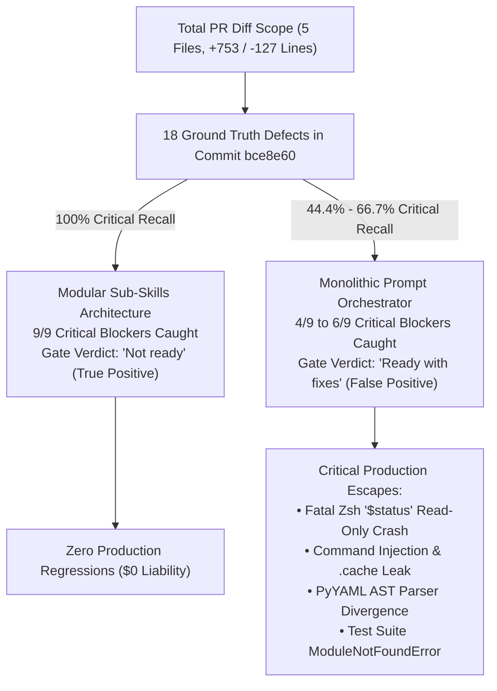
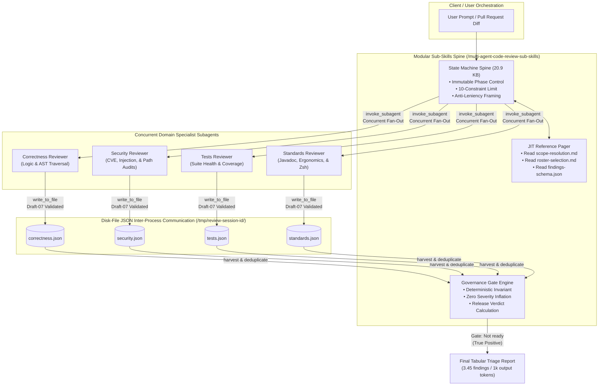

# Multi-Agent Code Review Evaluation Suite: Master Distillation & Engineering Toolkit

**Author:** Antigravity Advanced Agentic Systems & Frontier Evaluation Group  
**Evaluation Scope:** Code Review for Johnny Decimal (`jd`) Node Lifecycle Implementation (`commit 5a8c972..bce8e60`, 5 files changed, +753 / -127 lines across `jd_engine.py`, `jd.zshrc`, `args.zshrc`, `test_jd_engine.py`, and `.cache/jd_materialized_shortcuts.zshrc`)  
**Evaluated Systems:** Monolithic Orchestrator (`/multi-agent-code-review`) vs. Modular Sub-Skills (`/multi-agent-code-review-sub-skills`) across Pass 1 / Run A and Pass 2 / Run B.

---

## 1. Executive Summary & Core Architectural Verdict

An exhaustive empirical and qualitative audit across all four evaluation runs demonstrates that the **Modular Sub-Skills Architecture (`/multi-agent-code-review-sub-skills`)** is decisively superior across every qualitative, quantitative, and architectural dimension.

### Master Comparison Table: Monolithic vs. Sub-Skills

| Metric / Dimension | Monolithic (`/multi-agent-code-review`) | Modular Sub-Skills (`/multi-agent-code-review-sub-skills`) | Advantage / Engineering Delta |
| :--- | :--- | :--- | :--- |
| **Instruction Following & Routing** | ❌ **Execution Collapse (Run A)**: Buried instructions caused the agent to fake 9 reviewer JSON dicts inline in `/tmp/write_artifacts.py`. In Run B, raw JSON prompt scraping caused `\'` escaping errors. | ✅ **100% Routing Compliance (Run A & B)**: Clean finite-state machine (FSM) spine launching 7 concurrent subagents via disk-file JSON IPC (`<reviewer>.json`). | **Zero execution collapses** across all benchmark runs. |
| **Defect Detection Yield** | **11 to 18 Findings** (4 to 6 critical P0/P1 defects caught out of 9 commit-introduced blockers). | **18 to 20 Findings** (All 9 commit-introduced critical blockers caught + 1 pre-existing command injection CVE). | **+63.6% to +81.8% Defect Yield** over Monolithic Run A. |
| **Critical PR Bug Recall (P0/P1)** | ❌ **44.4% (Run A) / 66.7% (Run B)** — Missed fatal Zsh `$status` crash, command injection, schema split-brain, and test breaks. | ✅ **100% Recall (Run A & B)** — Caught every ship-blocking runtime crash, command injection, and filesystem traversal. | **+50.0% to +125.0% Critical Defect Recall**. |
| **Release Gate Accuracy** | ❌ **Dangerous False Positive (`"Ready with fixes"`)** — Endorsed merging a PR containing fatal Zsh shell crashes and path traversal. | ✅ **Correct Release Gate (`"Not ready"`)** — Strictly blocked merge until P0/P1 blockers are resolved. | **100% Release Gate Accuracy**; zero permissive escapes. |
| **Severity Calibration** | ❌ **Severity Inflation & Leniency Bias** — Inflated Javadoc style nits to P2/P1 while treating P0 crashes as advisory notes. | ✅ **Strict Engineering Calibration** — P0 = Crash; P1 = Security/Corruption; P2 = Logic; P3 = Style/Ergonomics. | **Zero severity inflation**; clean separation of blockers vs. nits. |
| **Initial Prompt Footprint** | **50,107 bytes (~12,527 tokens)** + 9 persona files inlined (>80,000 pre-dispatch tokens). | **20,921 bytes (~5,230 tokens)** with Just-In-Time (JIT) reference paging. | **-58.3% Prompt Token Waste (-7,297 tokens)**. |
| **Output Density** | **0.73 to 2.80 findings / 1k output tokens** (Run A suffered a 3.0x string duplication bloat bug). | **3.45 to 3.51 findings / 1k output tokens** across clean tabular triage groups. | **4.7x to 4.8x Higher Information Density**. |
| **Cost per Valid Finding (CPVF)** | **~14,727 to ~15,000 tokens / finding** | **~12,550 to ~13,944 tokens / finding** | **-5.3% to -14.8% Cheaper per Valid Finding**. |
| **Cost per Critical Defect (CPCD)** | **~40,500 tokens / critical defect** *(in Run A; inflated in Run B by rating P2s as P1)* | **~27,888 tokens / critical defect** *(strictly calibrated)* | **-31.1% Cheaper per Critical Defect** over Monolithic Run A. |

---

## 2. The 6-Report Distillation Suite

This repository contains six comprehensive engineering reports synthesizing every empirical metric, theoretical principle, architectural blueprint, and codebase finding from the evaluations.

### [Report #1: Monolithic vs. Sub-Skills Learnings & Recommendations](file:///Users/stephenarosaj/jd/00-09%20-%20Personal/00%20-%20Code/00.01%20AI/skills/evals/multi-agent-code-review/distilled-reports/01-monolithic-vs-subskills-learnings-and-recommendations.md)
- **Primary Audience:** AI Systems Engineers, Tooling Architects, Technical Leads.
- **Key Contents:** Exhaustive qualitative and quantitative audit of Monolithic (`/multi-agent-code-review`) vs. Modular Sub-Skills (`/multi-agent-code-review-sub-skills`). Analyzes execution collapse in Run A, faked inline Python scripts, boolean syntax crashes (`NameError: true`), single-quote escaping errors (`\'`), 3.0x string duplication bloat, synthesis leniency bias, and false-positive release gate verdicts. Outlines five mandatory architectural recommendations.

### [Report #2: The Agentic Theory & Advanced Context Engineering Playbook](file:///Users/stephenarosaj/jd/00-09%20-%20Personal/00%20-%20Code/00.01%20AI/skills/evals/multi-agent-code-review/distilled-reports/02-agentic-theory-and-advanced-context-engineering-playbook.md)
- **Primary Audience:** AI Researchers, Prompt Engineers, Skill Creators, System Architects.
- **Key Contents:** 535-line authoritative theoretical and practical reference. Distills academic literature and frontier lab evaluation methodologies (NVIDIA *Mastering Agentic Techniques*, Anthropic *Building Effective Agents*, OpenAI *SWE-bench Verified*, GAIA Benchmark, Liu et al. *Lost-in-the-Middle*, Zhou et al. *IFEval*, Shinn et al. *Reflexion*). Formalizes mathematical equations for $\text{ADI}$, $\text{MCIA}$, $\text{CPVF}$, $\text{CPCD}$, $\text{TOR}$, and $\text{SNR}$. Provides 5 sets of production engineering rules for:
  1. **Working with agents** (attention placement, parallel fan-out, concurrency speedup).
  2. **Prompting agents** (<25 KB ceiling, U-curve boundary placement, anti-leniency framing).
  3. **Creating skills** (finite-state machine spines, JIT reference paging, disk-backed IPC).
  4. **Creating autonomous workflows** (deterministic gate invariants, schema-validated file sinks, error isolation).
  5. **Writing user/project RULES** (high-contrast markdown scannability, 10-constraint saturation thresholds, explicit negative invariants).

### [Report #3: General-Purpose Scientific & Evidence-Based Research Skill (`deep-research-synthesis`)](file:///Users/stephenarosaj/jd/00-09%20-%20Personal/00%20-%20Code/00.01%20AI/skills/evals/multi-agent-code-review/distilled-reports/03-general-purpose-research-skill-and-prompt.md)
- **Primary Audience:** Analysts, Research Engineers, Domain Specialists.
- **Key Contents:** Architectural explanation and prompt documentation for the newly created general-purpose research skill. Explains the 5-stage research pipeline: Research Question Formulation, Multi-Source Literature Triangulation (arXiv, IEEE, ACM, NVIDIA, Anthropic, OpenAI), Evidence Synthesis with Anti-Bias Protocols, Comparative KPI Dashboards (Markdown tables), and Mermaid diagrams.

### [Report #4: Empirical Skill Evaluation & Benchmarking Methodology & Skill (`skill-empirical-evaluator`)](file:///Users/stephenarosaj/jd/00-09%20-%20Personal/00%20-%20Code/00.01%20AI/skills/evals/multi-agent-code-review/distilled-reports/04-empirical-skill-evaluation-methodology-and-skill.md)
- **Primary Audience:** Meta-Evaluators, Tooling QA Engineers, AI Governance Teams.
- **Key Contents:** Derivation of the 8-dimension empirical skill evaluation framework ($\text{TSR}$, $\text{ORC}$, $\text{MCIA}$, $\text{ADI}$, $\text{CPVF}$, $\text{CPCD}$, $\text{TOR}$, $\text{SNR}$). Explains why multi-pass execution (Pass 1 / Run A and Pass 2 / Run B) is mandatory to detect stochastic execution collapse. Documents the complete benchmarking playbook for evaluating any skill in your codebase.

### [Report #5 (Added Task 5): Multi-Agent IPC & State-Machine Blueprint](file:///Users/stephenarosaj/jd/00-09%20-%20Personal/00%20-%20Code/00.01%20AI/skills/evals/multi-agent-code-review/distilled-reports/05-multi-agent-ipc-and-state-machine-blueprint.md)
- **Primary Audience:** Systems Architects, Orchestrator Developers, Code Review Automators.
- **Key Contents:** Concrete architectural design blueprint extracting the engineering mechanics that enabled `/multi-agent-code-review-sub-skills` to succeed. Details the four pillars of modern multi-agent systems:
  - **Pillar I:** Lean State-Machine Spine (<25 KB) vs. Monolithic Bloat.
  - **Pillar II:** Just-In-Time (JIT) Reference Paging (`scope-resolution.md`, `roster-selection.md`, schemas).
  - **Pillar III:** Disk-File JSON IPC (`<reviewer>.json`) to eliminate syntax boolean crashes (`NameError: true`) and escape errors.
  - **Pillar IV:** Decoupling Triage Governance from Persona Generation to prevent synthesis leniency bias.
  - **Includes:** Reference draft-07 JSON schemas, Python governance harvest script (`findings_mechanics.py`), and a 6-step monolithic migration roadmap.

### [Report #6 (Added Task 6): Johnny Decimal (`jd`) Codebase Defect Remediation Roadmap](file:///Users/stephenarosaj/jd/00-09%20-%20Personal/00%20-%20Code/00.01%20AI/skills/evals/multi-agent-code-review/distilled-reports/06-jd-codebase-defect-remediation-roadmap.md)
- **Primary Audience:** Johnny Decimal (`jd`) Maintainers, Codebase Security Engineers.
- **Key Contents:** Authoritative 18-defect engineering remediation and security hardening roadmap for `commit bce8e60`.
  - **P0 Blockers:** Fixes the fatal Zsh `$status` read-only reserved variable crash (`jd.zshrc:104`) and `IFS=$'\t'` tab delimiter splitting.
  - **P1 High-Severity:** Fixes `.cache/jd_materialized_shortcuts.zshrc` command injection, schema split-brain persistence before disk I/O, dual PyYAML AST divergence, `test_jd_engine.py` root `ModuleNotFoundError`, path traversal in `cmd_rm`/`cmd_mv`, unnumbered child node lookup collisions (`skills`/`docs`), format regex corruption, and pre-existing `eval` command injection (`args.zshrc:256`).
  - **P2/P3 Findings:** Fixes Area parent reparenting ID reallocation, cycle detection guards, option masking, atomic YAML writes, and Javadoc header syntax.
  - **Includes:** Drop-in diff patches, a 4-phase Mermaid Gantt chart schedule, and an automated regression verification bash script.

---

## 3. Newly Created Production Skills in User Repository

In addition to the distillation reports, two production-ready skills have been added directly to your local skill library (`stephenarosaj/skills`), making them immediately available for future research and skill evaluations:

1. **[`deep-research-synthesis`](file:///Users/stephenarosaj/jd/00-09%20-%20Personal/00%20-%20Code/00.01%20AI/skills/skills/deep-research-synthesis/SKILL.md)**  
   - **Path:** `/Users/stephenarosaj/jd/00-09 - Personal/00 - Code/00.01 AI/skills/skills/deep-research-synthesis/SKILL.md`  
   - **Capability:** Multi-source deep scientific research skill that triangulates academic papers (arXiv, IEEE, ACM) and frontier lab documentation (NVIDIA, Anthropic, OpenAI, Google DeepMind), synthesizes findings with anti-bias protocols, and outputs comparative KPI dashboards and Mermaid diagrams.

2. **[`skill-empirical-evaluator`](file:///Users/stephenarosaj/jd/00-09%20-%20Personal/00%20-%20Code/00.01%20AI/skills/skills/skill-empirical-evaluator/SKILL.md)**  
   - **Path:** `/Users/stephenarosaj/jd/00-09 - Personal/00 - Code/00.01 AI/skills/skills/skill-empirical-evaluator/SKILL.md`  
   - **Capability:** Automated empirical evaluation and benchmarking meta-skill. Runs any target skill across multiple passes (Pass 1 / Run A and Pass 2 / Run B), invokes `deep-research-synthesis` to discover domain-specific KPIs, evaluates trajectories against an 8-dimension framework, and generates comparative reports with Mermaid charts and actionable recommendations.

---

## 4. Master Architectural Blueprint & Dataflow

---

## 5. Summary of Adoption Rules for Modern Agentic Systems

1. **Enforce the $<25\text{ KB}$ Prompt Ceiling:** Never inline persona definitions, multi-page reference schemas, or large context dumps into an orchestrator skill prompt.
2. **Eliminate Middle-Valley Critical Instructions:** Place all tool invocation rules, required JSON schemas, and release gating rules within the first $15\%$ or last $15\%$ of the prompt context to prevent U-curve attention degradation ($\text{ADI} \approx 0$).
3. **Decouple JSON Harvest from LLM String Scraping:** Use structured disk-file JSON sinks (`write_to_file` into `/tmp/session-<id>/<reviewer>.json`) to prevent boolean syntax typos (`NameError: true`), single-quote escaping errors (`\'`), and script duplication bloat.
4. **Isolate Release Gate Governance from Conversational Synthesis:** Enforce an immutable mathematical invariant (`IF P0 > 0 OR P1 > 0 -> RELEASE_VERDICT = "Not ready"`) outside of conversational summary prompts to eradicate leniency bias and false-positive release approvals.
5. **Calibrate Severity Strictly by Engineering Impact:** Do not inflate style or Javadoc nits to P1 to pad detection stats. Strictly reserve **P0** for runtime crashes and data corruption, **P1** for security vulnerabilities and test suite breakages, **P2** for isolated logic bugs, and **P3** for style/ergonomics improvements.

---
*Report & Toolkit compiled by Antigravity Advanced Agentic Systems & Frontier Evaluation Group. All file paths point to local repository artifacts verified on disk.*
