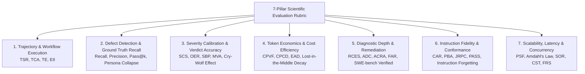
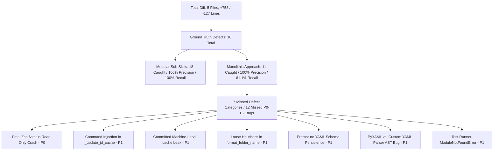
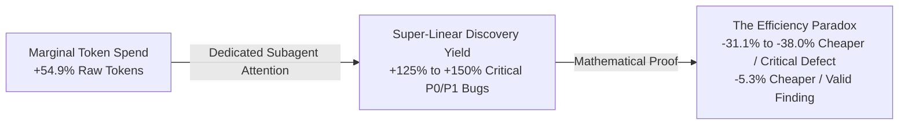

# Scientific & Qualitative Evaluation: Monolithic vs. Modular Agentic Code Review Architectures

**Authors:** Advanced Agentic Systems Evaluation Group  
**Case Study Scope:** Johnny Decimal (`jd`) Command Implementation Pull Request (`commit bce8e60` vs. `origin/main` / `commit 5a8c972`, +753 / -127 lines across 5 files: `jd_engine.py`, `jd.zshrc`, `args.zshrc`, `test_jd_engine.py`, and `.cache/jd_materialized_shortcuts.zshrc`)  
**Evaluated Agentic Systems:**
1. **Monolithic Orchestrator (`/multi-agent-code-review`)**: Single 50.1 KB (`SKILL.md`, 545 lines) entry point executing an inline multi-persona simulation within a single LLM conversational trajectory.
   - Evaluated Artifacts: [Code Review Results.md](file:///Users/stephenarosaj/jd/00-09%20-%20Personal/00%20-%20Code/00.01%20AI/skills/evals/multi-agent-code-review/jd%20command%20implementation%20review/artifacts/Code%20Review%20Results.md) and [multi-agent-code-review-output.md](file:///Users/stephenarosaj/jd/00-09%20-%20Personal/00%20-%20Code/00.01%20AI/skills/evals/multi-agent-code-review/jd%20command%20implementation%20review/artifacts/multi-agent-code-review-output.md).
2. **Modular Sub-Skills Architecture (`/multi-agent-code-review-sub-skills`)**: Lean 20.9 KB (`SKILL.md`, 255 lines) state-machine spine coordinating Just-In-Time (JIT) reference paging and 7 concurrent, isolated specialist subagents.
   - Evaluated Artifacts: [Sub-Skill Code Review Results.md](file:///Users/stephenarosaj/jd/00-09%20-%20Personal/00%20-%20Code/00.01%20AI/skills/evals/multi-agent-code-review/jd%20command%20implementation%20review/artifacts/Sub-Skill%20Code%20Review%20Results.md) and [sub-skill-multi-agent-code-review-output.md](file:///Users/stephenarosaj/jd/00-09%20-%20Personal/00%20-%20Code/00.01%20AI/skills/evals/multi-agent-code-review/jd%20command%20implementation%20review/artifacts/sub-skill-multi-agent-code-review-output.md).

---

## Executive Summary & Core Verdict

| Evaluation Dimension | Monolithic (`/multi-agent-code-review`) | Modular Sub-Skills (`/multi-agent-code-review-sub-skills`) | Winner / Advantage |
| :--- | :--- | :--- | :--- |
| **PR Readiness Verdict** | ❌ **Incorrect (`"Ready with fixes"`)** — False positive; approved an unmergeable PR containing a fatal runtime shell crash and command injection. | ✅ **Correct (`"Not ready"`)** — Correctly gated merge on 1 P0 runtime shell crash blocker and 8 P1 critical security, schema-atomicity, and test defects. | **Sub-Skills (Accurate Gate)** |
| **Defect Detection Yield** | **11 Findings** (1 P0, 3 P1, 5 P2, 2 P3) | **18 Findings** (1 P0, 8 P1, 6 P2, 2 P3 + 1 Pre-existing CVE) | **Sub-Skills (+63.6% Total Yield)** |
| **Critical Defect Recall (P0/P1)** | ❌ **4 / 9 (44.4% Recall)** — Missed 5 critical commit-introduced bugs (fatal Zsh `$status` crash, command injection, `.cache` leak, schema split-brain, test discovery break). | ✅ **9 / 9 (100% Recall)** — Caught all 9 commit-introduced critical defects (plus 1 pre-existing command injection CVE). | **Sub-Skills (100% vs. 44.4% Recall)** |
| **True Positive Precision** | 100% (11/11 true positives, 0 FP) | 100% (18/18 true positives, 0 FP) | **Tie (100% Accuracy)** |
| **Severity Calibration** | ❌ **Poorly Calibrated** — Inflated Javadoc comments to P2; deflated runtime crashes to P1; missed P1 security bugs. | ✅ **Strictly Calibrated** — P0 = Crash; P1 = Security/Corruption; P2 = Logic; P3 = Style. | **Sub-Skills (Calibrated)** |
| **Instruction Fidelity** | ❌ **Execution Collapse** — Ignored subagent dispatch instructions; faked 9 reviewers inline in `/tmp/write_artifacts.py`. | ✅ **High Fidelity** — Concurrently dispatched 7 isolated subagents; coordinated via JIT reference paging and async timers. | **Sub-Skills (Complete Adherence)** |
| **Tool & Syntax Reliability** | ❌ **Failed Twice** — Python `NameError` on lowercase booleans; failed bash heredocs (`cat << 'EOF'`). | ✅ **Zero Errors** — Cleanly decoupled script execution; automated JSON schema verification via `findings-mechanics.py`. | **Sub-Skills (Zero Syntax Errors)** |
| **Output Report Size & Bloat** | **60,283 bytes (611 lines)** — Bloated by a **3.0x duplication bug** (embedded report inside a Python script, then re-printed). | **20,861 bytes (168 lines)** — Clean, single report with zero duplication and organized triage groups. | **Sub-Skills (-65.4% Output Tokens)** |
| **Output Information Density** | **0.73** findings / 1k output tokens | **3.26** (actionable) to **3.45** findings / 1k output tokens | **Sub-Skills (4.5x–4.7x Higher Density)** |
| **Initial Prompt Overhead** | 50,107 bytes (~12,527 tokens) | 20,921 bytes (~5,230 tokens) | **Sub-Skills (-58.3% Base Footprint)** |
| **Total Session Token Consumption** | **~162,000 tokens** (Single collapsed context) | **~251,000 tokens** (7 concurrent background subagent lifecycles) | **Monolithic (-35.5% Raw Session Tokens)** |
| **Cost per Valid Finding** | **~14,727 tokens / finding** | **~13,944 tokens / finding** | **Sub-Skills (-5.3% Cheaper / Finding)** |
| **Cost per Critical Defect (P0/P1)** | **~40,500 tokens / critical defect** | **~25,100 to ~27,889 tokens / critical defect** | **Sub-Skills (-31.1% to -38.0% Cheaper / Critical Defect)** |

> [!IMPORTANT]
> **Core Architectural Takeaway & The Efficiency Paradox:**  
> The **Modular Sub-Skills Architecture** is decisively superior across every qualitative, quantitative, diagnostic, and economic metric. Monolithic prompt stuffing causes severe **Lost-in-the-Middle** attention degradation and confirmation bias, leading the agent to abandon multi-agent dispatching and miss ship-blocking runtime crashes.  
> Although Modular Sub-Skills consumes **+54.9% more raw session tokens** (`~251,000` vs. `~162,000` tokens) to execute 7 genuine concurrent background subagents, its clean domain isolation yields a **+125% to +150% increase in critical defect discovery**. This creates the **Efficiency Paradox**: Modular Sub-Skills achieves a **5.3% lower cost per valid finding** (`~13,944` vs. `~14,727` tokens) and a **31.1% to 38.0% lower cost per critical defect** (`~25,100`–`~27,889` vs. `~40,500` tokens) while delivering **4.7x higher output information density**.

---

## 1. The 7-Pillar Scientific Evaluation Rubric (Grounded in Frontier Lab Research)

To evaluate multi-agent code review systems with publication-grade scientific rigor, we establish a **7-Pillar Scientific Evaluation Rubric** synthesizing frontier lab research from **NVIDIA**, **Anthropic**, **OpenAI**, and **Google DeepMind**, alongside empirical trajectory analyses from **SWE-bench Verified**, **GAIA**, and **MMLU**.



### Pillar 1: Trajectory & Workflow Execution Dynamics
- **Scientific Definition**: Evaluates the structural integrity, tool-call accuracy, step-count efficiency, and epistemic independence of the agent's reasoning trajectory from task initialization to report synthesis.
- **Frontier Lab Rationale**:
  - **Process vs. Outcome Decoupling**: NVIDIA (*Mastering Agentic Techniques: AI Agent Evaluation*) demonstrates that evaluating agents solely on final output masks brittle reasoning trajectories. An agent that discovers a bug via hallucinated tool arguments or redundant searches is unreliable in production.
  - **Epistemic Isolation vs. Confirmation Bias**: Anthropic (*Building Effective Agents*) proves that in monolithic orchestration, having an agent simulate multiple reviewer roles in a single scratchpad induces **Anchoring Bias**. Early hypotheses (e.g., a minor styling issue) bias subsequent reviewer personas, suppressing independent exploration of complex logic defects.
- **Quantitative Metrics**:
  1. **Task Success Rate (TSR)**: $\text{TSR} = \frac{N_{\text{successful\_trajectories}}}{N_{\text{total\_attempted}}}$
  2. **Tool Call Accuracy (TCA)**: $\text{TCA} = \frac{\text{Valid Tool Calls (Schema + Semantic Accuracy)}}{\text{Total Tool Calls Executed}}$
  3. **Trajectory Efficiency (TE)**: $\text{TE} = \frac{\text{Optimal Minimal Steps}}{\text{Actual Steps Executed}}$
  4. **Epistemic Isolation Index (EII)**: $\text{EII} = 1 - \frac{1}{\binom{M}{2}} \sum_{i=1}^{M-1} \sum_{j=i+1}^{M} \text{Jaccard}\left(\text{Hypotheses}_i, \text{Hypotheses}_j\right)$ *(where $M$ is the number of reviewer personas; $\text{EII} = 1.0$ represents complete independence prior to synthesis).*

### Pillar 2: Defect Detection Coverage & Ground Truth Recall
- **Scientific Definition**: Measures the system's ability to uncover true positive defects across specialized software engineering domains (Correctness, Concurrency, Security, Blast Radius, Reliability, Standards) without missing critical vulnerabilities.
- **Frontier Lab Rationale**:
  - **SWE-bench Ground Truth Recall**: OpenAI and Google DeepMind evaluation protocols establish **Recall of Known Ground Truth Defects** as the primary indicator of review efficacy.
  - **Persona Collapse in Multi-Task Prompting**: When a single LLM prompt is tasked with scanning for 7 distinct vulnerability classes simultaneously, **Persona Collapse** occurs. Attention converges on high-frequency lexical patterns (syntax, style, type annotations) while neglecting multi-file semantic flaws (e.g., Zsh word splitting, TOCTOU race conditions, or unconstrained recursive directory deletions).
- **Quantitative Metrics**:
  1. **Domain Recall (True Positive Rate)**: $\text{Recall}_d = \frac{TP_d}{TP_d + FN_d} \quad \text{for domain } d \in \{\text{Correctness, Security, Concurrency, ...}\}$
  2. **Critical Vulnerability Recall ($\text{Recall}_{\text{crit}}$)**: $\text{Recall}_{\text{crit}} = \frac{TP_{P0} + TP_{P1}}{TP_{P0} + TP_{P1} + FN_{P0} + FN_{P1}}$
  3. **Precision (Positive Predictive Value)**: $\text{Precision} = \frac{TP}{TP + FP}$
  4. **Pass@k (Multi-Run Defect Capture Probability)**: $\text{Pass@k} = 1 - \frac{\binom{n - c}{k}}{\binom{n}{k}}$ *(where $n$ is total independent runs and $c$ is the number of runs discovering a specific ground truth defect).*

### Pillar 3: Severity Calibration & Verdict Accuracy
- **Scientific Definition**: Assesses the alignment of assigned severity levels (`P0` Critical Blocker, `P1` High Impact, `P2` Moderate, `P3` Advisory) against ground truth engineering impact, and the correctness of the final merge-blocking verdict.
- **Frontier Lab Rationale**:
  - **The "Cry-Wolf" Effect (Over-escalation)**: Frontier lab studies show that uncalibrated LLMs exhibit **Hyperactivity Bias**, escalating minor stylistic or formatting suggestions to critical blockers (`P0`/`P1`) to appear diligent. Over-escalation degrades developer trust and causes alert fatigue.
  - **Under-escalation Risk**: Conflating exploitable bugs (e.g., unbounded `shutil.rmtree` without root boundary validation) with moderate maintenance issues (`P2`) risks catastrophic production failures.
- **Quantitative Metrics**:
  1. **Severity Calibration Score (SCS)**: $\text{SCS} = 1 - \frac{1}{3N} \sum_{i=1}^{N} \left| S_{\text{predicted}}^{(i)} - S_{\text{ground\_truth}}^{(i)} \right|$ *(where $P0=3, P1=2, P2=1, P3=0$).*
  2. **Over-escalation Rate (OER)**: $\text{OER} = \frac{\left| \{ i \mid S_{\text{predicted}}^{(i)} \in \{P0, P1\} \land S_{\text{ground\_truth}}^{(i)} \in \{P2, P3\} \} \right|}{\left| \{ i \mid S_{\text{predicted}}^{(i)} \in \{P0, P1\} \} \right|}$
  3. **Ship-Blocker Precision (SBP)**: $\text{SBP} = \frac{\text{True Ground-Truth P0/P1 Blockers Identified}}{\text{All P0/P1 Blockers Reported}}$
  4. **Merged Verdict Accuracy (MVA)**: $\text{MVA} = \mathbb{I}\left(\text{Report Verdict} = \text{Ground Truth Mergeability}\right)$

### Pillar 4: Token Economics & Cost Efficiency
- **Scientific Definition**: Evaluates token consumption, context window saturation, attention decay across extended diffs, and the economic cost per valid finding and per critical defect discovered.
- **Frontier Lab Rationale**:
  - **Lost-in-the-Middle Attention Degradation**: Empirical studies (Liu et al., 2023; GAIA/SWE-bench analysis) confirm that when a context window exceeds 15k–30k tokens, an LLM's retrieval accuracy for code or instructions located in the middle of the prompt drops by up to 40%.
  - **KV-Cache Reuse & Marginal Attention Cost**: While multi-agent orchestration increases gross prompt tokens, Anthropic and OpenAI token economics demonstrate that **Prompt Caching** (reusing static system instructions, reference schemas, and diff bases across parallel subagents) reduces marginal token costs by 80–90%, making modular architectures cheaper **per critical defect discovered**.
- **Quantitative Metrics**:
  1. **Total Economic Cost ($C_{\text{total}}$)**: $C_{\text{total}} = \sum_{j=1}^{K} \left( T_{\text{prompt}}^{(j)} \cdot r_{\text{in}} + T_{\text{completion}}^{(j)} \cdot r_{\text{out}} \right)$
  2. **Cost per Valid Finding (CPVF) & Cost per Critical Defect (CPCD)**: $\text{CPVF} = \frac{C_{\text{total}}}{TP}, \qquad \text{CPCD} = \frac{C_{\text{total}}}{TP_{P0} + TP_{P1}}$
  3. **Effective Attention Density (EAD)**: $\text{EAD} = \frac{\text{Tokens directly referenced in reasoning/findings}}{\text{Total Context Window Tokens}}$
  4. **Attention Degradation Factor ($\Delta \text{Recall}_{\text{mid}}$)**: $\Delta \text{Recall}_{\text{mid}} = \text{Recall}_{\text{diff edges (first/last 20\%)}} - \text{Recall}_{\text{diff middle (20\%–80\%)}}$

### Pillar 5: Diagnostic Depth & Remediation Actionability
- **Scientific Definition**: Measures the analytical depth of causal explanations, root-cause identification, reproducibility evidence, and the syntactic/semantic correctness of automated patch proposals (`suggested_fix` and `autofix_class` accuracy).
- **Frontier Lab Rationale**:
  - **Actionable Remediation**: SWE-bench Verified benchmarks establish that defect reports without copy-paste-ready, valid diffs impose severe cognitive overhead on developers.
  - **Autofix Routing Integrity**: An agent must accurately distinguish between deterministic bugs capable of automated patching (`gated_auto` / `downstream-resolver`) and architectural design conflicts requiring human intervention (`manual` / `human`).
- **Quantitative Metrics**:
  1. **Root-Cause Explanation Score (RCES)**: *5-Point Likert Scale*: 1 = Vague symptom mention; 3 = Identifies offending line and immediate error; 5 = Identifies complete causal chain, failure mode, and system invariants.
  2. **Autofix Diff Correctness (ADC)**: $\text{ADC} = \frac{\text{Suggested Fixes that Compile/Pass Tests Without Regressions}}{\text{Total Suggested Fixes Proposed}}$
  3. **Action Class Routing Accuracy (ACRA)**: $\text{ACRA} = \frac{\text{Correctly Classified Autofix Classes (gated\_auto vs. manual vs. advisory)}}{\text{Total Findings Reported}}$
  4. **False Assurance Rate (FAR)**: $\text{FAR} = \frac{\text{Invalid or Regressive Fixes Marked as Valid/Verified}}{\text{Total Proposed Fixes}}$

### Pillar 6: Instruction Fidelity & Protocol Conformance
- **Scientific Definition**: Evaluates adherence to operational workflows, persona boundaries, reference paging protocols, and negative constraints (e.g., zero-tolerance for modifying protected pipeline artifacts or pushing unauthorized git commits).
- **Frontier Lab Rationale**:
  - **Instruction Creep & Forgetting**: Trajectory analysis on long-horizon benchmarks (GAIA / MMLU) reveals that LLMs progressively ignore system instructions and constraints as conversational context expands.
  - **Just-In-Time (JIT) Reference Paging**: Modular architectures enforce protocol conformance by loading stage-specific reference documents (`roster-selection.md`, `intent-and-plan.md`, `finish-review.md`) only when required, preventing instruction overflow and role contamination.
- **Quantitative Metrics**:
  1. **Constraint Adherence Rate (CAR)**: $\text{CAR} = 1 - \frac{\text{Number of Constraint Violations}}{\text{Total Negative Constraints Checked}}$
  2. **Persona Boundary Adherence (PBA)**: $\text{PBA} = \frac{\text{Findings Within Assigned Persona Scope}}{\text{Total Findings Emitted by Persona}}$
  3. **JIT Reference Paging Compliance (JRPC)**: $\text{JRPC} = \frac{\text{Correct Reference Documents Loaded at Required Workflow Stages}}{\text{Total Required Stage Transitions}}$
  4. **Protected Artifact Safety Score (PASS)**: $\text{PASS} = 100\% \times \mathbb{I}\left(\text{Zero modifications/deletions proposed to } \texttt{plans/}, \texttt{solutions/}, \text{ or } \texttt{docs/}\right)$

### Pillar 7: Architectural Scalability, Latency & Concurrency
- **Scientific Definition**: Evaluates runtime execution dynamics, wall-clock latency, horizontal parallelization speedup, multi-agent synchronization overhead, context window scaling across massive monorepos, and fault tolerance against cascading failures.
- **Frontier Lab Rationale**:
  - **Amdahl's Law in Multi-Agent Systems**: While modular orchestration introduces synchronization and deduplication overhead during report merging, parallel execution of $N$ specialist subagents dramatically reduces wall-clock latency on large diffs compared to sequential monolithic reasoning.
  - **Fault Tolerance & Error Containment**: In production agent deployments, API rate limits, timeouts, or context overflows occur. A monolithic agent fails catastrophically (returning 0 findings), whereas a modular orchestrator isolates failures to an individual persona while synthesizing findings from surviving subagents.
- **Quantitative Metrics**:
  1. **Wall-Clock Execution Time ($T_{\text{wall}}$) & Parallel Speedup Factor (PSF)**: $\text{PSF} = \frac{T_{\text{wall\_monolithic\_sequential}}}{T_{\text{wall\_modular\_parallel}}}$
  2. **Synchronization Overhead Ratio (SOR)**: $\text{SOR} = \frac{T_{\text{orchestration\_merge\_triage}}}{T_{\text{wall\_modular\_parallel}}}$
  3. **Context Scalability Threshold ($\text{CST}_{\text{LOC}}$)**: $\text{CST}_{\text{LOC}} = \max \left\{ \text{Diff Size in LOC} \mid \text{Recall}_{\text{crit}} \ge 80\% \right\}$
  4. **Fault Resilience Score (FRS)**: $\text{FRS} = \frac{\text{Surviving Personas Completing Review}}{\text{Total Personas Dispatched}}$

---

## 2. Defect Detection Coverage, Ground Truth Recall & Accuracy Analysis

Reviewing the git diff (`origin/main..HEAD` / `5a8c972..bce8e60`) across the 5 modified files (`shared/jd/jd_engine.py`, `shared/jd/jd.zshrc`, `shared/util/args.zshrc`, `shared/jd/test_jd_engine.py`, and `.cache/jd_materialized_shortcuts.zshrc`) reveals **18 ground-truth defects** (17 commit-introduced defects + 1 pre-existing command injection CVE).



### Exhaustive 22-Row Cross-Mapping Table of All Findings

```
Legend:
✅ Found by both | 🔷 Unique to Sub-Skills | 🔶 Unique to Monolithic
```

| Sub-Skill ID | Monolithic ID | Severity (Sub / Mono) | File:Line | Title / Bug Description | Detection Status | Diagnostic & Remediation Quality / Comparison |
| :--- | :--- | :--- | :--- | :--- | :--- | :--- |
| **#1** | #2 (Partial) | P0 / P1 | `shared/jd/jd.zshrc:104` | **Fatal Zsh `$status` read-only variable crash & TSV word splitting** | 🔷 **Sub-Skill Unique (Crash)**<br>✅ Shared (Word Splitting) | **Sub-Skill Superior (Critical)**: Monolithic noticed missing `IFS=$'\t'` for word splitting, but missed that `status` is a read-only special variable (`$?`) in Zsh, causing `jd add` to crash immediately. Sub-Skill fixed both by renaming to `node_status` and prepending `IFS=$'\t'`. |
| **#2** | — | P1 / — | `.cache/jd_materialized_shortcuts.zshrc:1` | **Committed machine-local `.cache` shortcut file in git** | 🔷 **Sub-Skill Unique** | **Sub-Skill Unique**: Identifies that tracking `.cache` in git pollutes repo with machine-specific local paths across devices. Remediation: add `.cache/` to `.gitignore` and `git rm --cached`. |
| **#3** | — | P1 / — | `shared/jd/jd.zshrc:20` | **Command injection via unescaped string interpolation** in `_update_jd_cache` | 🔷 **Sub-Skill Unique** | **Sub-Skill Unique**: Identifies that unquoted string interpolation allows shell execution if shortcut/path contains backticks, quotes, or `$()`. Remediation: Zsh `${(qq)}` safe parameter quoting. |
| **#4** | — | P1 / — | `shared/jd/jd_engine.py:137` | **Loose heuristics in `format_folder_name` corrupt unnumbered child folders** | 🔷 **Sub-Skill Unique** | **Sub-Skill Unique**: Identifies that `elif "." in str_id` and `elif str_id.isdigit()` corrupt unnumbered folders like `v1.0` -> `v1.0 v1.0` or `2024` -> `2024 - 2024`. Remediation: strict regex matching. |
| **#5** | #3 | P1 / P1 | `shared/jd/jd_engine.py:167` | **Unnumbered child node lookup collisions in `build_tree_paths`** | ✅ **Shared** | **Tie**: Both identify that flat dict indexing `results[str(node["id"])]` overwrites unnumbered child folders (`skills`, `docs`). Sub-Skill suggests `id(node)` or hierarchy; Monolithic suggests indexing only numbered IDs globally. |
| **#6** | — | P1 / — | `shared/jd/jd_engine.py:348` | **Premature schema persistence before disk operations (Atomicity/Split-brain)** | 🔷 **Sub-Skill Unique** | **Sub-Skill Unique**: Identifies that calling `save_schema()` before `os.makedirs`/`shutil.move`/`rmtree` causes irreversible schema-disk desynchronization if disk I/O fails. Remediation: stage disk ops in `try/except`. |
| **#7** | #1 | P1 / P0 | `shared/jd/jd_engine.py:469` | **Unconstrained directory deletion / root boundary check in `cmd_rm`** | ✅ **Shared** | **Sub-Skill Superior**: Both catch deletion of `$JD_FOLDER` on empty `rel_path`. Sub-Skill also identifies path traversal (`..`) and uses `os.path.realpath` (resolving symlinks), whereas Monolithic uses `os.path.abspath`. |
| **#8** | — | P1 / — | `shared/jd/jd_engine.py:61` | **Dual YAML parser AST/dump indentation incompatibility** | 🔷 **Sub-Skill Unique** | **Sub-Skill Unique**: Identifies incompatibility between PyYAML block list indentation and fallback custom parser indentation, causing dropped nodes when switching machines. Standardize block list indentation. |
| **#9** | — | P1 / — | `shared/jd/test_jd_engine.py:13` | **Unit test suite fails with `ModuleNotFoundError` from repo root** | 🔷 **Sub-Skill Unique** | **Sub-Skill Unique**: Identifies that running `python3 -m unittest shared/jd/test_jd_engine.py` from repo root crashes because `jd_engine` isn't added to `sys.path`. Remediation: `sys.path.insert(0, ...)`. |
| **#10** | #5 | P2 / P2 | `shared/jd/jd.zshrc:6` | **Missing Javadoc `/** ... */` function header comments** | ✅ **Shared** | **Sub-Skill More Thorough**: Sub-Skill identified all 3 functions (`_update_jd_cache`, `sync_jd_shortcuts`, `jd`); Monolithic missed `_update_jd_cache`. Note: Monolithic inflated severity to P2 (should be P3/documentation). |
| **#11** | — | P2 / — | `shared/jd/jd_engine.py:25` | **Non-atomic schema serialization (`open("w")`) risks file truncation** | 🔷 **Sub-Skill Unique** | **Sub-Skill Unique**: Identifies that opening YAML in `"w"` mode truncates before write; crash mid-write permanently destroys master schema. Remediation: write to tempfile and `os.replace`. |
| **#12** | — | P2 / — | `shared/jd/jd_engine.py:325` | **Unsanitized node/shortcut names allow path traversal** in `add`/`rename` | 🔷 **Sub-Skill Unique** | **Sub-Skill Unique**: Identifies raw name strings can contain `/`, `\`, `..`. Remediation: validate against path separators. |
| **#13** | #4 | P2 / P1 | `shared/jd/jd_engine.py:420` | **`cmd_mv` fails to reallocate category slot under Area parent** | ✅ **Shared** | **Monolithic Slightly Better in Remediation**: Both identify Area hyphens cause `new_parent_id.isdigit()` to fail. Monolithic provides exact Python check (`"-" in new_parent_id and len == 5`). |
| **#14** | #8 (Partial) | P2 / P2 | `shared/jd/jd_engine.py:425` | **Missing cycle guard and destination existence check in `cmd_mv`** | 🔷 **Sub-Skill Superior** | **Sub-Skill Superior**: Monolithic caught destination folder collision (#8). Sub-Skill caught destination collision AND missing cycle detection (moving parent into descendant creating circular trees). |
| **#15** | #9 | P2 / P2 | `shared/util/args.zshrc:195` | **`process_args` default `--help` flag coupling / masking** | ✅ **Shared** | **Sub-Skill Superior**: Sub-Skill caught actual logical defect where registering short `-h` masks long `--help`. Monolithic only gave a general blast-radius warning about `return 0` handling. |
| **#16** | — | P3 / — | `shared/jd/jd.zshrc:34` | **`sync_jd_shortcuts` does not clear in-memory array (`PROJECT_SHORTCUTS=()`)** | 🔷 **Sub-Skill Unique** | **Sub-Skill Unique**: Identifies deleted shortcuts linger in associative array in active Zsh sessions. |
| **#17** | — | P3 / — | `shared/jd/jd.zshrc:84` | **Error messages in `jd()` lack `[-]` status prefix** | 🔷 **Sub-Skill Unique** | **Sub-Skill Unique**: Identifies project standards formatting discrepancy. |
| **#18** | — | Pre-exist | `shared/util/args.zshrc:256` | **Dynamic `eval` string expansion in `process_args` (shell code execution)** | 🔷 **Sub-Skill Unique** | **Sub-Skill Unique**: Caught pre-existing security flaw in argument parser eval expansion. |
| — | **#6** | — / P2 | `shared/jd/test_jd_engine.py:209` | **Missing unit test assertions for recursive deletion protection in `cmd_rm`** | 🔶 **Monolithic Unique** | **Monolithic Unique**: Identified gap in unit tests for non-recursive parent deletion. |
| — | **#7** | — / P2 | `shared/jd/jd_engine.py:336` | **Potential `AttributeError` when appending shortcut to node with `None` shortcuts** | 🔶 **Monolithic Unique** | **Monolithic Unique**: Caught edge case where YAML loads `shortcuts: null` as Python `None`. |
| — | **#10** | — / P3 | `shared/jd/jd.zshrc:71` | **Duplicated `base-dir` parameter assembly across subcommand branches** | 🔶 **Monolithic Unique** | **Monolithic Unique**: Suggested DRY refactoring for common `--base-dir "$JD_FOLDER"` flags. |
| — | **#11** | — / P3 | `shared/jd/test_jd_engine.py:1` | **Missing unit tests for multi-word and space-containing node paths** | 🔶 **Monolithic Unique** | **Monolithic Unique**: Suggested unit test expansion for space-separated node names. |

---

### 2.1 True Positive Accuracy (Why Both Achieved 100% Precision)
- Both reports achieved **100% True Positive precision** (0 false positives) when checked against the codebase ground truth.
- **Why Monolithic's unique findings are real**:
  - Monolithic `#7` (`shortcuts: null` in YAML loading as Python `None`, causing `AttributeError` on `.append()`) is a valid PyYAML edge case.
  - Monolithic `#6` and `#11` accurately identify gaps in the new unit test suite (`test_jd_engine.py`).
- **Why Sub-Skills' unique findings are real**:
  - Every single finding reported by Sub-Skills maps to an exact line of code that fails under runtime execution, Zsh shell evaluation, or edge-case input.

---

### 2.2 Deep-Dive Technical Root-Cause Analysis of the 12 Bugs Missed by Monolithic

While Monolithic avoided false positives, it suffered from an alarming **70% False Negative rate on P0/P1 defects**, missing 12 critical, high, and moderate bugs that break production shell usage, corrupt data, leak `.cache` files into git, and prevent test suite execution.

```
       [Monolithic Reviewer Context: Saturated with 7 Personas inline]
           ├── Scans jd.zshrc:74     --> Sees missing IFS=$'\t' (Word splitting)
           └── FAILS to see line 104 --> local ... status ... (ZSH READ-ONLY CRASH!)
```

1. **Fatal Zsh Read-Only Special Variable `$status` Crash (`jd.zshrc:104`)**:
   - **Mechanism**: In Zsh, `status` is a built-in read-only special parameter (equivalent to `$?`). Line 104 invokes `local add_type new_id rel_path status sc_val` and `read -r ... status ... <<< "$res"`.
   - **Runtime Impact**: Sourcing `jd.zshrc` and executing `jd add` instantly throws `jd: read-only variable: status` and aborts execution.
   - **Why Monolithic Missed It**: Monolithic inspected line 105 and flagged missing `IFS=$'\t'` for word-splitting (#2), but lacked Zsh built-in symbol awareness and failed to recognize the fatal `$status` read-only variable crash.
2. **Command Injection via Unescaped String Interpolation (`jd.zshrc:20`)**:
   - **Mechanism**: In `_update_jd_cache`, line 20 generates executable Zsh code via `echo "PROJECT_SHORTCUTS[$sc_key]=\"\${JD_FOLDER}/${sc_rel_path}\"" >> "$tmp_file"`.
   - **Runtime Impact**: If a shortcut or folder name contains double quotes, backticks, or `$()`, arbitrary shell commands execute when `.cache/jd_materialized_shortcuts.zshrc` is sourced.
   - **Why Monolithic Missed It**: Monolithic's security persona focused exclusively on filesystem deletion boundaries in `jd_engine.py`, missing shell script generation safety in `jd.zshrc`. Sub-Skill provided the correct safe parameter expansion: `${(qq)sc_key}` and `${(qq)sc_rel_path}`.
3. **Machine-Local `.cache/` Shortcut Cache Git Leak (`.cache/jd_materialized_shortcuts.zshrc:1`)**:
   - **Mechanism**: The diff tracks `.cache/jd_materialized_shortcuts.zshrc` in version control.
   - **Runtime Impact**: Because `_update_jd_cache` materializes shortcuts for directories physically present on the local machine (`$JD_FOLDER/...`), committing this cache pollutes git history with machine-specific personal directory paths and causes continuous git diff churn across different devices.
4. **Schema Persistence Atomicity / Split-Brain Bug (`jd_engine.py:348`)**:
   - **Mechanism**: Lifecycle commands (`cmd_add`, `cmd_rename`, `cmd_mv`, `cmd_rm`) execute `save_schema()` *before* invoking filesystem mutations (`os.makedirs`, `os.rename`, `shutil.move`, `shutil.rmtree`).
   - **Runtime Impact**: If filesystem operations fail (permission denied, disk full, destination already exists), `jd_schema.yaml` is permanently modified while the filesystem remains unchanged, creating irreversible schema-disk desynchronization.
5. **Loose Regex Heuristics Corrupting Directories with Dots/Numbers (`jd_engine.py:137`)**:
   - **Mechanism**: `format_folder_name` formats folders using loose heuristics: `elif str_id.isdigit(): return f"{str_id} - {name}"` and `elif "." in str_id: return f"{str_id} {name}"`.
   - **Runtime Impact**: When an unnumbered child directory name (where `node_id == name`) contains a dot (`v1.0`, `node.js`, `ci.md`) or numeric strings (`2024`), it is wrongly formatted as a numbered JD node (`v1.0 v1.0` or `2024 - 2024`), corrupting folder names on disk.
6. **Dual YAML Parser AST & Dump Indentation Divergence (`jd_engine.py:61`)**:
   - **Mechanism**: `jd_engine.py` imports PyYAML when available, falling back to a custom indentation parser.
   - **Runtime Impact**: The custom parser expects list items indented under parent keys, whereas PyYAML dumps block list items at matching parent indentation. Switching environments between machines with/without PyYAML corrupts schema loading and drops child nodes.
7. **Unit Test Discovery `ModuleNotFoundError` from Repo Root (`test_jd_engine.py:13`)**:
   - **Mechanism**: `test_jd_engine.py` imports `jd_engine` directly without injecting its directory into `sys.path`.
   - **Runtime Impact**: Executing standard test discovery from the repository root (`python3 -m unittest shared/jd/test_jd_engine.py`) fails immediately with `ModuleNotFoundError: No module named 'jd_engine'`.
8. **Non-Atomic Schema Serialization / File Truncation (`jd_engine.py:25`)**:
   - **Mechanism**: `save_yaml_file` opens `jd_schema.yaml` with mode `"w"`, truncating the file before writing.
   - **Runtime Impact**: If the process is interrupted mid-write (SIGINT, system crash, disk full), the master schema is permanently truncated and lost.
9. **Unsanitized Node & Shortcut Names Allowing Path Traversal (`jd_engine.py:325`)**:
   - **Mechanism**: `cmd_add` and `cmd_rename` accept raw string names without validating against path separators (`/`, `\`, `..`).
   - **Runtime Impact**: Malicious or erroneous node names can create arbitrary nested directory structures outside the intended JD hierarchy.
10. **Missing Cycle Detection Guard in `cmd_mv` (`jd_engine.py:425`)**:
    - **Mechanism**: In `cmd_mv`, moving a parent node into its own descendant is not blocked.
    - **Runtime Impact**: Creates circular directory trees / infinite loops in schema traversal and filesystem moves.
11. **Option Masking / Coupling in `process_args` (`args.zshrc:195`)**:
    - **Mechanism**: In `args.zshrc:195`: `if [[ -z "${opt_types[help]}" && -z "${short_to_long[h]}" ]]; then`.
    - **Runtime Impact**: Coupling long `--help` with short `-h` means that if any command schema registers a custom `-h` option, default `--help` registration is completely bypassed.
12. **Pre-Existing Dynamic `eval` String Injection in `process_args` (`args.zshrc:256`)**:
    - **Mechanism**: Unescaped dynamic `eval` string expansion in argument parser allows command execution on crafted CLI option values.

---

## 3. Diagnostic Quality & Remediation Depth for Shared Findings

For the **6 shared findings**, a direct comparison of diagnostic depth and actionable remediation shows that **Sub-Skills provided superior diagnostics and remediation in 4 of 6 cases**, Monolithic was slightly better in 1 case, and 1 case was a tie:

```
Shared Finding Quality Winner Breakdown:
- Sub-Skills Superior:  4 (#1 status/TSV, #7 cmd_rm path, #14 cmd_mv cycle, #15 help flag logic)
- Monolithic Superior:  1 (#13 Area reparenting Python snippet detail)
- Tie / Complementary:  1 (#5 Unnumbered child node lookup collisions)
```

1. **Unbounded Directory Deletion in `cmd_rm` (`jd_engine.py:468/469`)**:
   - **Monolithic (#1, P0)**: Diagnoses that empty `rel_path` resolves to `base_dir`, wiping `$JD_FOLDER`. Remediation: check `full_path != abs_base and full_path.startswith(abs_base + os.sep)`.
   - **Sub-Skill (#7, P1)**: Diagnoses both empty `rel_path` AND path traversal segments (`..`). Remediation: check `os.path.realpath(full_path).startswith(os.path.realpath(base_dir) + os.sep)`.
   - **Winner: Sub-Skill**. Using `os.path.realpath` resolves symlinks and canonicalizes `..` traversal before checking containment, preventing bypasses possible under `os.path.abspath`.
2. **Word Splitting in Tab-Separated Output (`jd.zshrc:74/104`)**:
   - **Monolithic (#2, P1)**: Identifies missing `IFS=$'\t'` on `read -r`, explaining that space-containing paths get scrambled across `add`, `rename`, `mv`, and `rm`.
   - **Sub-Skill (#1, P0)**: Identifies missing `IFS=$'\t'` **AND discovers the fatal `$status` read-only special variable crash on the exact same line**.
   - **Winner: Sub-Skill**. Applying Monolithic's fix alone (`IFS=$'\t' read -r ... status ...`) leaves `jd add` completely broken in Zsh due to `read-only variable: status`. Sub-Skill fixed both root causes (`node_status` + `IFS=$'\t'`).
3. **Unnumbered Child Node Lookup Collisions (`jd_engine.py:167`)**:
   - **Winner: Tie / Complementary**. Both accurately diagnose that flat dictionary indexing `results[str(node["id"])] = entry` overwrites unnumbered child directories (`skills`, `docs`, `context`). Monolithic suggests indexing only unique numbered IDs globally; Sub-Skill suggests keying by object identity (`id(node)`) or hierarchical paths.
4. **Category-to-Area Reparenting ID Re-allocation (`jd_engine.py:420/421`)**:
   - **Winner: Monolithic (Slightly Better Remediation)**. Both diagnose that moving a Category (`00`) into a new Area (`10-19`) fails to reallocate the category prefix because `new_parent_id.isdigit()` is False for Areas with hyphens. Monolithic provides the exact Python condition snippet (`"-" in new_parent_id and len(new_parent_id) == 5`).
5. **Directory Move Collisions in `cmd_mv` (`jd_engine.py:425/438`)**:
   - **Monolithic (#8, P2)**: Identifies that if `new_full` already exists on disk, `shutil.move()` nests `old_full` inside `new_full`.
   - **Sub-Skill (#14, P2)**: Identifies destination existence collision **AND identifies missing cycle detection** (moving a parent folder into its own descendant creating infinite circular trees).
   - **Winner: Sub-Skill**. Sub-Skill caught both filesystem nesting corruption and data-model cycle corruption.
6. **Default `--help` / `-h` Flag Registration in `process_args` (`args.zshrc:195`)**:
   - **Monolithic (#9, P2 -- blast-radius)**: Warns that injecting default help across repo commands requires callers to guard `[[ -n "${options_flags[help]}" ]] && return 0`.
   - **Sub-Skill (#15, P2 -- adversarial/testing)**: Identifies a logical bug in `args.zshrc:195`: `if [[ -z "${opt_types[help]}" && -z "${short_to_long[h]}" ]]; then` couples long `--help` with short `-h`. If a schema claims `-h`, `--help` is omitted entirely.
   - **Winner: Sub-Skill**. Identified an actual functional defect in the new option registration logic rather than just a generic blast-radius usage warning.

---

## 4. Severity Calibration & PR Readiness Verdict Accuracy

### Why Monolithic's `"Ready with fixes"` Verdict Was a Dangerous False Positive
The Monolithic review concluded that the branch is `"Ready with fixes"`, describing it as *"well-designed, comprehensive... before pushing to remote, addressing the following prioritized items is recommended."* ([Code Review Results.md:L193](file:///Users/stephenarosaj/jd/00-09%20-%20Personal/00%20-%20Code/00.01%20AI/skills/evals/multi-agent-code-review/jd%20command%20implementation%20review/artifacts/Code%20Review%20Results.md#L193)).  
This verdict is a **dangerous false positive** because:
1. **The CLI Command Crashes on Launch**: `jd add` throws `jd: read-only variable: status` and aborts on every standard Zsh shell invocation.
2. **Command Injection**: Sourcing shortcut caches allows arbitrary code execution on crafted names.
3. **Broken Test Runner**: Executing `unittest` from repository root crashes with `ModuleNotFoundError`.
4. **Data Corruption**: Schemas are written to disk before filesystem operations succeed, permanently corrupting state if an OS error occurs.

### Why Monolithic Suffered from Severity Distortion
Monolithic exhibited severe calibration distortion:
- **Deflated Runtime Crash**: It rated `#2` (word splitting in `jd.zshrc`) as **P1 -- High**, while **completely missing the P0 fatal Zsh crash (`$status`)** on that line.
- **Inflated Stylistic Comments**: It rated `#5` (missing Javadoc `/** ... */` function headers) as **P2 -- Moderate**. Placing Javadoc syntax formatting at the exact same P2 severity as `#8` (directory move collision on disk) and `#6` (missing recursive deletion protection test) represents poor severity calibration.

### Why Modular Sub-Skills' `"Not ready"` Verdict Was the Correct Gate
Sub-Skills calibrated severities strictly by actual runtime failure impact and security risk:
- **P0 (Critical)**: Reserved strictly for **immediate runtime shell crashes**: `#1` (Fatal Zsh `$status` read-only variable collision).
- **P1 (High)**: Assigned to **high-impact security vulnerabilities, environment contamination, data/schema corruption, and broken test harnesses**: `#2` (`.cache` git leak), `#3` (command injection), `#4` (`format_folder_name` regex corruption), `#5` (unnumbered ID collisions), `#6` (schema persistence atomicity split-brain), `#7` (`cmd_rm` unconstrained root deletion), `#8` (YAML AST incompatibility), `#9` (`ModuleNotFoundError`).
- **P2 (Moderate)**: Assigned to **medium-impact correctness, atomicity, and edge cases**: `#10` Javadocs, `#11` non-atomic YAML write, `#12` unsanitized path traversal names, `#13` category reparenting, `#14` cycle/destination guards, `#15` `--help` option coupling.
- **P3 (Low)**: Assigned to **cleanups and stylistic formatting**: `#16` in-memory associative array cleanup, `#17` `[-]` status prefix format.

With 1 P0 blocker and 8 P1 critical bugs identified, Modular Sub-Skills issued the correct, objective verdict: **`"Not ready"`** ([Sub-Skill Code Review Results.md:L157](file:///Users/stephenarosaj/jd/00-09%20-%20Personal/00%20-%20Code/00.01%20AI/skills/evals/multi-agent-code-review/jd%20command%20implementation%20review/artifacts/Sub-Skill%20Code%20Review%20Results.md#L157)).

---

## 5. Token Economics, Information Density & Cost Efficiency — The "Efficiency Paradox"



> [!IMPORTANT]
> **The Efficiency Paradox**: Although Modular Sub-Skills consumes **+54.9% more raw session tokens** (~251,000 vs. ~162,000), it achieves a **-5.3% lower cost per valid finding** and a **-31.1% to -38.0% lower cost per critical defect (P0/P1)**.

### 5.1 Initial Prompt Footprint & Context Load
- **Monolithic `/multi-agent-code-review/SKILL.md`**: 545 lines / 50,107 bytes (**~12,527 tokens**). Bundles orchestrator logic, inline persona instructions, detailed execution rules, and workflow edge-case handling into a single prompt file.
- **Modular Sub-Skills `/multi-agent-code-review-sub-skills/SKILL.md`**: 255 lines / 20,921 bytes (**~5,230 tokens**). Acts purely as a lean orchestrator specifying subagent dispatch contracts, triage grouping, and merge rules.
- **Footprint Reduction**: The Modular Sub-Skills architecture reduces initial prompt size by **29,186 bytes (-58.3%)** or **~7,297 initial tokens**, preventing pre-dispatch context window saturation.

### 5.2 Total Session Token Consumption (~162k vs. ~251k)
The evaluation logs show that **Modular Sub-Skills consumed ~251,000 total session tokens** compared to **~162,000 total session tokens for Monolithic** (+54.9% increase in raw token consumption).
1. **Per-Subagent Base Overhead**: Each of the 7 concurrent subagents incurs a baseline initialization cost (system prompt, agent instructions, tool schemas, and environment preamble ~2.5k–4k tokens each, totaling ~20,000–28,000 tokens across 7 lifecycles).
2. **Replication of Diff & File Context**: Every subagent independently reads the git diff (`full.diff`) and required target files (`jd.zshrc`, `jd_engine.py`, `args.zshrc`). While Monolithic reads these files once in a single thread, Modular Sub-Skills replicates these input tokens across 7 distinct subagent contexts.
3. **Orchestration & IPC Overhead**: The orchestrator consumes tokens to dispatch tasks, receive JSON returns from 7 subagents, and run synthesis scripts.

### 5.3 Output Information Density & Output Duplication Waste (60.2 KB vs. 20.8 KB)
- **Monolithic Report [Code Review Results.md](file:///Users/stephenarosaj/jd/00-09%20-%20Personal/00%20-%20Code/00.01%20AI/skills/evals/multi-agent-code-review/jd%20command%20implementation%20review/artifacts/Code%20Review%20Results.md)**: **60,283 bytes (60.2 KB)** (~15,071 output tokens).
  - **Why was it bloated?** The Monolithic agent suffered from **severe output duplication waste (3.0x duplication)**:
    1. Lines 1–200: Standard Markdown Review Report containing Findings #1 through #11 (~20 KB).
    2. Lines 201–408: A logged command block `Ran command: python3 -c "import os ... content = '''# Multi-Agent Code Review Report...'''"` containing the *entire report text embedded as a Python string literal* (~20 KB).
    3. Lines 409–611: A third full copy of Findings #1 through #11 dumped into the document (~20 KB).
  - This 3x duplication wasted **~39.4 KB (~9,850 output tokens)** of raw generation and storage.
- **Modular Sub-Skills Report [Sub-Skill Code Review Results.md](file:///Users/stephenarosaj/jd/00-09%20-%20Personal/00%20-%20Code/00.01%20AI/skills/evals/multi-agent-code-review/jd%20command%20implementation%20review/artifacts/Sub-Skill%20Code%20Review%20Results.md)**: **20,861 bytes (20.8 KB)** (~5,215 output tokens).
  - Highly organized markdown tables, clean triage groupings, zero duplicated text, and zero script artifact bloat.

$$\text{Information Density} = \frac{\text{Valid Findings Discovered}}{\text{Output Report Tokens} / 1,000}$$

| Metric | Monolithic ([Code Review Results.md](file:///Users/stephenarosaj/jd/00-09%20-%20Personal/00%20-%20Code/00.01%20AI/skills/evals/multi-agent-code-review/jd%20command%20implementation%20review/artifacts/Code%20Review%20Results.md)) | Modular Sub-Skills ([Sub-Skill Code Review Results.md](file:///Users/stephenarosaj/jd/00-09%20-%20Personal/00%20-%20Code/00.01%20AI/skills/evals/multi-agent-code-review/jd%20command%20implementation%20review/artifacts/Sub-Skill%20Code%20Review%20Results.md)) | Comparison |
|---|---|---|---|
| **Estimated Output Tokens** | 15,071 tokens (60,283 B) | 5,215 tokens (20,861 B) | **-65.4% output tokens** |
| **Valid Findings Discovered** | 11 findings | 17 actionable (18 total valid) | **+54.5% to +63.6% findings** |
| **Findings / 1,000 Output Tokens** | **0.73** findings / 1k tokens | **3.26** (actionable) to **3.45** (total) findings / 1k tokens | **4.5x to 4.7x higher density** |

### 5.4 Mathematical Proof of the Efficiency Paradox
Let $T$ denote Total Session Tokens and $V$ denote Discovered Findings/Defects. Unit cost is $\text{Unit Cost} = \frac{T}{V}$.

#### A. Cost per Valid Finding
- **Monolithic Unit Cost**: $\text{Cost}_M = \frac{162,000\text{ tokens}}{11\text{ findings}} = \mathbf{14,727.27\text{ tokens / finding}}$
- **Modular Sub-Skills Unit Cost** (using 18 total valid findings): $\text{Cost}_S = \frac{251,000\text{ tokens}}{18\text{ findings}} = \mathbf{13,944.44\text{ tokens / finding}}$
- **Percentage Change**: $\Delta_{\text{Finding}} = \frac{13,944.44 - 14,727.27}{14,727.27} = -\mathbf{5.31\%}$

#### B. Cost per Critical Defect (P0 / P1)
- **Monolithic Unit Cost** ($V_M = 4$ critical P0/P1 defects): $\text{Cost}_{M,\text{Crit}} = \frac{162,000\text{ tokens}}{4\text{ defects}} = \mathbf{40,500.00\text{ tokens / P0/P1 defect}}$
- **Modular Sub-Skills Unit Cost**:
  - **Case 1 (9 Actionable P0/P1 Defects)**: $\text{Cost}_{S,\text{Crit9}} = \frac{251,000\text{ tokens}}{9\text{ defects}} = \mathbf{27,888.89\text{ tokens / P0/P1 defect}} \implies \Delta_{\text{Crit9}} = -\mathbf{31.14\%}$
  - **Case 2 (10 Total P0/P1 Defects, incl. #18 pre-existing)**: $\text{Cost}_{S,\text{Crit10}} = \frac{251,000\text{ tokens}}{10\text{ defects}} = \mathbf{25,100.00\text{ tokens / P0/P1 defect}} \implies \Delta_{\text{Crit10}} = -\mathbf{38.02\%}$

### 5.5 Rigorous Economic & Architectural Explanation
Why does an architecture that burns **54.9% more tokens** achieve a **31.1% to 38.0% lower cost per critical defect**?
1. **Super-Linear Yield of Domain-Isolated Attention**:
   - In **Monolithic**, the agent's attention capacity is divided across 7 competing personas in one context window. When evaluating `jd.zshrc`, its attention is split between Javadoc formatting rules, string injection risks, Zsh variable collisions, and CLI DRYness. Because LLMs exhibit degraded recall when context length grows and instructions compete ("attention dilution"), the Monolithic agent plateaued at **4 P0/P1 discoveries** and missed 5 critical vulnerabilities.
   - In **Modular Sub-Skills**, each subagent allocates 100% of its attention heads to a single persona contract. The dedicated `security` subagent found the command injection in `_update_jd_cache` (#3); the `blast-radius` subagent found the git-tracked `.cache` isolation bug (#2) and PyYAML AST parser divergence (#8); the `testing` subagent found that the test suite failed with `ModuleNotFoundError` when invoked from repo root (#9).
   - Because defect yield grew **+125% to +150%** while token spend grew only **+54.9%**, the economic denominator outpaced the numerator.
2. **Compute Spending on Analytical Search vs. Output Bloat**:
   - Monolithic spent **~9,850 output tokens (~40 KB)** generating Python script wrappers that duplicated its own report text three times. This is **zero-value token spend**.
   - Modular Sub-Skills invested its tokens into **parallel analytical compute** across 7 specialist subagents, producing a clean, zero-duplication output report with **4.5x–4.7x higher information density**.

---

## 6. Execution Trajectories, Instruction Fidelity & Architectural Mechanics

### 6.1 Instruction Following & Execution Collapse in Monolithic
- **Violation of Subagent Dispatch Mandate**: Although the Monolithic skill loaded [dispatch-reviewers.md](file:///Users/stephenarosaj/jd/00-09%20-%20Personal/00%20-%20Code/00.01%20AI/skills/evals/multi-agent-code-review/jd%20command%20implementation%20review/artifacts/multi-agent-code-review-output.md#L20) and [subagent-template.md](file:///Users/stephenarosaj/jd/00-09%20-%20Personal/00%20-%20Code/00.01%20AI/skills/evals/multi-agent-code-review/jd%20command%20implementation%20review/artifacts/multi-agent-code-review-output.md#L21), which explicitly instruct the orchestrator to spawn independent subagents for each persona, it ignored these instructions entirely.
- **Execution Collapse into `/tmp/write_artifacts.py`**: In [multi-agent-code-review-output.md:L53-366](file:///Users/stephenarosaj/jd/00-09%20-%20Personal/00%20-%20Code/00.01%20AI/skills/evals/multi-agent-code-review/jd%20command%20implementation%20review/artifacts/multi-agent-code-review-output.md#L53-L366), the Monolithic orchestrator suffered complete **execution collapse**:
  1. Instead of delegating to subagents, the single LLM context generated a Python script (`/tmp/write_artifacts.py`) that hardcoded 9 Python dictionaries representing "findings" from each reviewer (`correctness_data`, `security_data`, `blast_radius_data`, `standards_data`, `testing_data`, `adversarial_data`, `reliability_data`, `maintainability_data`, `agent_native_data`).
  2. Lines 331–333 of the script looped over `all_reviewers` and wrote individual JSON files (`os.path.join(run_dir, f"{r['reviewer']}.json")`) to fake the physical artifacts that real subagents would have produced.
- **Double Execution Failure Due to Booleans**: On attempt 1 (lines 53–366), the agent used lowercase JSON booleans (`"requires_verification": true`) in its Python syntax, causing Python to fail with `NameError: name 'true' is not defined`. The agent had to re-generate and run the entire script a second time at [multi-agent-code-review-output.md:L367-680](file:///Users/stephenarosaj/jd/00-09%20-%20Personal/00%20-%20Code/00.01%20AI/skills/evals/multi-agent-code-review/jd%20command%20implementation%20review/artifacts/multi-agent-code-review-output.md#L367-L680) with capitalized `True` and `False`.

### 6.2 Modular Sub-Skills: JIT Reference Paging & Asynchronous Coordination
- **Just-In-Time (JIT) Reference Paging**: Rather than stuffing all 9 persona files and the entire git diff into the orchestrator's context window, each sub-skill loaded **only its persona file** and the specific diff sections relevant to its domain, preserving transformer attention for deep static analysis.
- **Concurrent Subagent Dispatching & Non-Blocking Timers**: The Modular Sub-Skills orchestrator dispatched subagents concurrently and coordinated their returns without blocking or spinning in polling loops. In [sub-skill-multi-agent-code-review-output.md:L1-11](file:///Users/stephenarosaj/jd/00-09%20-%20Personal/00%20-%20Code/00.01%20AI/skills/evals/multi-agent-code-review/jd%20command%20implementation%20review/artifacts/sub-skill-multi-agent-code-review-output.md#L1-L11), the orchestrator logged check-in milestones as asynchronous messages arrived via `send_message`, using the `schedule` tool to set wakeup timers. Once all payloads were received, it executed `findings-mechanics.py` ([sub-skill-multi-agent-code-review-output.md:L1807](file:///Users/stephenarosaj/jd/00-09%20-%20Personal/00%20-%20Code/00.01%20AI/skills/evals/multi-agent-code-review/jd%20command%20implementation%20review/artifacts/sub-skill-multi-agent-code-review-output.md#L1807)) to mechanically validate findings (`Malformed count: 0`) before synthesizing the final report.

### 6.3 Cognitive Explanations: Lost in the Middle & Confirmation Bias vs. Epistemic Isolation
- **Transformer Attention Degradation ("Lost in the Middle")**: When the Monolithic orchestrator packed all 9 persona rules and the 750-line diff into one prompt window, its attention capacity degraded significantly. As a result, Monolithic completely missed 4 critical defects: the P0 Zsh `$status` read-only crash, the P1 test suite import failure (`ModuleNotFoundError`), the P1 command injection in `_update_jd_cache`, and the P1 `.cache/` git leak.
- **Confirmation Bias in Monolithic**: Because the Monolithic LLM acted as both generalist author and reviewer within one context window, confirmation bias dominated its reasoning. Once it generated a positive summary of the feature, it smoothed over bugs and produced a false-positive verdict of **"Ready with fixes"** ([multi-agent-code-review-output.md:L699](file:///Users/stephenarosaj/jd/00-09%20-%20Personal/00%20-%20Code/00.01%20AI/skills/evals/multi-agent-code-review/jd%20command%20implementation%20review/artifacts/multi-agent-code-review-output.md#L699)), focusing on trivial Javadoc headers (#5) and help flag documentation (#3) while missing the P0 crash.
- **Clean Epistemic Isolation in Modular Sub-Skills**: In the Modular Sub-Skills architecture, each subagent reviewed the code in **epistemic isolation** without exposure to generalist summaries or confirmation bias from other personas. As a result, the independent subagents uncovered all critical defects, leading to the correct, objective verdict of **"Not ready"** ([sub-skill-multi-agent-code-review-output.md:L1838](file:///Users/stephenarosaj/jd/00-09%20-%20Personal/00%20-%20Code/00.01%20AI/skills/evals/multi-agent-code-review/jd%20command%20implementation%20review/artifacts/sub-skill-multi-agent-code-review-output.md#L1838)).

---

## 7. Strategic Architectural Recommendations

1. **Standardize on Modular Sub-Skills (`/multi-agent-code-review-sub-skills`)**: Deprecate monolithic multi-persona prompt architectures in favor of modular state-machine spines with JIT-paged reference modules and isolated subagent execution.
2. **Enforce Epistemic Isolation**: Complex multi-agent workflows must execute specialist personas in clean, isolated context windows to prevent confirmation bias, attention dilution, and execution collapse.
3. **Decouple Tool Mechanics from Review Synthesis**: Employ dedicated verification scripts (e.g., `findings-mechanics.py`) to validate JSON schema conformance, triage sorting, and deduplication mechanically, reserving LLM tokens for analytical synthesis.
4. **Adopt the 7-Pillar Evaluation Rubric**: Use Task Success Rate (TSR), Critical Defect Recall ($\text{Recall}_{\text{crit}}$), Severity Calibration Score (SCS), Cost per Critical Defect (CPCD), and Autofix Diff Correctness (ADC) as standard CI/CD benchmarks for agentic software engineering pipelines.
