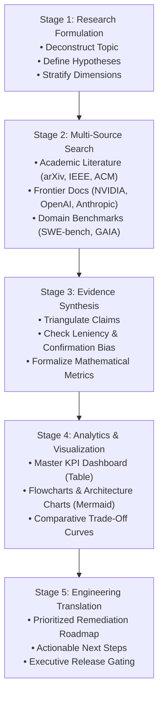

# Deep Research & Evidence-Based Synthesis Protocol (`deep-research-synthesis`)

The `deep-research-synthesis` skill equips an autonomous agent to conduct graduate-level scientific literature reviews, empirical evaluation design, and architectural comparative analysis. It enforces rigorous methodology, multi-source triangulation, objective quantitative metrics, and structured visual reporting to eliminate speculation, leniency bias, and superficial summarization.

---

## Executive Philosophy & Methodological Invariants

When investigating complex engineering architectures, multi-agent systems, or domain workflows, informal summarization fails to capture system dynamics. Frontier research from NVIDIA (*Mastering Agentic Techniques*), Anthropic (*Building Effective Agents*), and OpenAI (*Practices for Governing Agentic AI Systems*) demonstrates that robust evaluation requires:
1. **Multi-Source Triangulation:** Cross-referencing claims across academic papers, frontier lab technical reports, official SDK documentation, and empirical codebase evidence.
2. **Quantitative Rigor:** Deriving formal evaluation formulas and KPIs rather than relying on subjective adjectives.
3. **Traceable Attribution:** Every empirical claim, benchmark reference, or architectural insight must be anchored to verifiable citations, URLs, or repository line numbers.
4. **Visual Density:** Complex comparisons must be organized into high-density comparative KPI dashboards (Markdown tables) and syntax-verified Mermaid charts.

---

## 5-Stage Scientific Research Workflow

---

### Stage 1: Research Question Formulation & Dimension Discovery

Before executing external searches or analyzing code, formulate a structured research schema:

1. **Deconstruct Core Hypotheses:**
   - Define clear, falsifiable hypotheses regarding the target systems, architectures, or domains being compared.
   - Example: *Hypothesis: Monolithic multi-persona prompts experience severe attention degradation (Lost-in-the-Middle) compared to modular sub-skill architectures with Just-In-Time (JIT) reference paging.*
2. **Establish Evaluation Dimensions (Quantitative & Qualitative):**
   - Identify 5 to 8 orthogonal evaluation dimensions tailored to the domain.
   - For agentic systems, mandatory dimensions include:
     - **Task Success Rate (TSR) & Release Gate Correctness** (Confusion Matrix: TPs, FPs, TNs, FNs).
     - **Instruction Following & Routing Compliance** (Orchestrator Routing Compliance [ORC], Multi-Constraint Adherence [MCIA]).
     - **Context Window Dynamics & Attention Recall** (Attention Degradation Index [ADI], U-curve profiling).
     - **Defect Recall, Precision, & Severity Calibration** (Stratified P0–P3 precision/recall, Signal-to-Noise Ratio [SNR]).
     - **Token Economics & Unit Cost Efficacy** (Cost per Valid Finding [CPVF], Cost per Critical Defect [CPCD]).
     - **Tool Call Accuracy (TCA) & Trajectory Optimality Ratio (TOR)**.
     - **Error Resilience & Self-Correction Stability** (Loop termination rate, syntax exception isolation).
     - **Wall-Clock Latency & Concurrency Factor** ($S_{\text{parallel}}$).

---

### Stage 2: Multi-Source Literature & Documentation Search

Execute methodical search patterns across primary and secondary sources using available search tools (`search_web`, `read_url_content`, or specialist research subagents):

1. **Academic Literature Search (arXiv, IEEE, ACM):**
   - Search for foundational algorithms, scaling laws, and benchmarking methodologies.
   - Required foundational anchor citations for agentic workflows:
     - Liu et al., *Lost in the Middle: How Language Models Use Long Contexts* (2023) — Attention U-curve degradation.
     - Zhou et al., *IFEval: Instruction Following Evaluation for Large Language Models* (2023) — Constraint dilution.
     - Shinn et al., *Reflexion: Language Agents with Verbal Reinforcement Learning* (2023) — Self-correction loop dynamics.
     - Mialon et al., *GAIA: A Benchmark for General AI Assistants* (2023) — Architectural benchmark standards.
2. **Frontier Lab Technical Reports & Whitepapers:**
   - Query publications from leading frontier labs to ground recommendations in production-proven patterns:
     - **NVIDIA:** *Mastering Agentic Techniques: AI Agent Evaluation* (2026) — Process metrics vs. outcome correctness.
     - **Anthropic:** *Building Effective Agents* (2024) — Workflow simplification, parallel subagents, and bounded toolsets.
     - **OpenAI:** *Practices for Governing Agentic AI Systems* & *SWE-bench Verified* (2024) — Token budget governance and release gate integrity.
     - **Google DeepMind / Antigravity:** Multi-agent state-machine orchestration and JIT reference paging.
3. **Domain-Specific Benchmarks & Standardized Frameworks:**
   - Anchor quality and security evaluations to recognized industry standards:
     - NIST Static Analysis Tool Exposition (SATE), CWE/CVE vulnerability scoring, and Google SecureCoder rules.
     - Berkeley Function-Calling Leaderboard (BFCL) and WebArena trajectory evaluation frameworks.

---

### Stage 3: Evidence-Based Synthesis & Anti-Bias Protocol

Synthesize raw search and empirical findings into coherent, verifiable arguments while actively guarding against common analytical fallacies:

1. **Strict Attribution & Citation Protocol:**
   - Every metric, theoretical claim, or empirical result MUST cite its primary source using clickable GitHub-style markdown links (`[Author, Year](url)` or `[file.py:L10-L25](file:///path)`).
   - Never assert unverified statistics or subjective claims without empirical derivation.
2. **Mathematical Formulation of KPIs:**
   - Formally state equations used to compare systems. For example:
     $$\text{CPVF} = \frac{\text{Total Session Tokens}}{\text{True Positive Findings}}, \quad \text{CPCD}_{\text{P0/P1}} = \frac{\text{Total Session Tokens}}{\text{Remediated P0 + P1 Blockers}}$$
     $$\text{ADI} = \text{Accuracy}_{\text{boundaries}} - \text{Accuracy}_{\text{middle}}, \quad \text{TOR} = \frac{L_{\text{optimal}}}{L_{\text{actual}}}$$
3. **Anti-Bias Safeguards:**
   - **Mitigate Synthesis Leniency Bias:** Do not allow polite summarizing or confirmation bias to soften critical architectural failures. If a system introduces a P0 runtime crash or security vulnerability, explicitly mark its release verdict as a **False Positive** if it claims readiness.
   - **Prevent Severity Inflation:** Differentiate true ship-blocking crashes (P0) and security/data-corruption flaws (P1) from logic edge cases (P2) and style/documentation nits (P3).

---

### Stage 4: Comparative Analytics & Visualization Engine

Organize all synthesized data into scannable, high-density visual artifacts:

1. **Master Comparative KPI Dashboard (Table Requirement):**
   - Every research report MUST feature an executive KPI table comparing evaluated systems across all defined dimensions.
   - Required Columns: `Evaluation Metric | System A (Baseline/Monolithic) | System B (Experimental/Modular) | Advantage Delta / Verdict`.
   - Ensure cell contents are concise, quantified, and visually highlighted using symbols (`✅`, `❌`, `⚠️`, `P0`, `P1`).
2. **Mermaid Architectural & Trajectory Diagrams:**
   - Embed Mermaid graphs to visualize data flow, failure modes, or attention distributions.
   - **Syntax Safeguards:**
     - Always quote labels containing parentheses, brackets, or special symbols (e.g., `id["Label (Details)"]`).
     - Avoid bare ASCII arrows or HTML tags in node titles.
   - Supported chart styles: `graph TD` (hierarchical flows), `sequenceDiagram` (subagent IPC), and ASCII character charts for context U-curves.

---

### Stage 5: Actionable Engineering Recommendations

End every research synthesis with a concrete, prioritized engineering roadmap:

1. **Architectural Deprecations:** Identify obsolete, bloated, or unstable patterns that must be removed immediately.
2. **Pattern Standardizations:** Highlight modular, token-efficient, and highly scalable designs to adopt across repositories.
3. **Execution Safeguards:** Specify automation rules (e.g., JIT file loading, structured JSON schema sinks, bounded subagent toolsets) to prevent regressions.

---

## Operational Execution Rules for Agents

- **When invoked standalone:** Conduct the full 5-stage research workflow on the user's target topic, producing a comprehensive research report artifact (`<topic>_research_synthesis.md`).
- **When invoked as a sub-skill:** Execute targeted domain research on specific evaluation dimensions or benchmarks, returning structured JSON or markdown summaries to the caller agent.
- **Artifact Creation:** Always write final research reports to the session artifact directory (`<appDataDir>/brain/<conversation-id>/`) with descriptive filenames. Do NOT summarize the entire artifact in conversational chat; provide an executive summary and clickable link.
