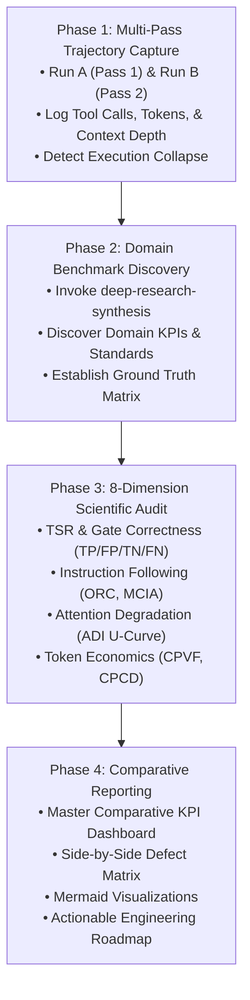

# Empirical Skill Evaluation & Benchmarking Protocol (`skill-empirical-evaluator`)

The `skill-empirical-evaluator` skill is an automated, scientifically grounded benchmarking engine for AI skills and agentic architectures. It replaces subjective impression with reproducible multi-pass execution, rigorous trajectory analysis, quantitative unit economics, and domain-specific benchmarking.

---

## Executive Philosophy & Methodological Invariants

Evaluating an agentic skill on a single test prompt is statistically unreliable. Frontier research from NVIDIA (*Mastering Agentic Techniques*), Anthropic (*Building Effective Agents*), and OpenAI (*Practices for Governing Agentic AI Systems*) establishes that an empirical skill evaluator must enforce four invariants:

1. **Multi-Pass Execution (Run A / Run B):** Every skill must be evaluated across at least two independent runs on standardized test cases to detect stochastic execution collapse, syntax failures, and variance.
2. **Trajectory & Token Auditing:** Evaluation must inspect the agent's intermediate tool calls, context window depth, token expenditure, and error-recovery loops—not just the final text response.
3. **Domain-Specific Benchmark Triangulation:** Before grading, the evaluator must discover domain standards (CWE/CVE, NIST SATE, SWE-bench, GAIA, WebArena) by invoking `deep-research-synthesis`.
4. **The 8-Dimension Scientific Audit:** Every skill must be scored against 8 orthogonal quantitative and qualitative dimensions, formalized with algebraic equations and confusion matrices.

---

## 4-Phase Empirical Benchmarking Workflow

---

### Phase 1: Multi-Pass Trajectory & Output Capture

To evaluate a target skill (`<target_skill_path>`) against a standardized test case (`<test_case_or_commit>`):

1. **Execute Two Independent Evaluation Passes:**
   - **Pass 1 (Run A):** Execute the target skill against the test case under cold-start conditions.
   - **Pass 2 (Run B):** Execute a second independent pass to test statistical stability and reproducibility.
2. **Capture Full Execution Trajectories:**
   - For each pass, log:
     - **Pre-Dispatch Prompt Footprint:** Byte and token count of `SKILL.md` plus any inlined prompt payloads.
     - **Tool Call Sequence:** Record every tool invocation (`invoke_subagent`, `run_command`, `replace_file_content`, etc.).
     - **Subagent Concurrency:** Measure the number of concurrent subagents spawned versus sequential conversational bottlenecks.
     - **Execution Collapse Detection:** Monitor if the orchestrator abandons subagent dispatch instructions and falls back to writing local simulation scripts (e.g., Python scripts faking subagent JSON outputs).
     - **Token Usage & Bloat:** Track total session tokens, prompt overhead, and output formatting bloat (e.g., duplicated report strings).

---

### Phase 2: Domain-Specific Benchmark Discovery via `deep-research-synthesis`

Before auditing the captured trajectories, the evaluator must establish domain-specific grading criteria:

1. **Invoke `deep-research-synthesis` (Sub-Skill Call):**
   - Call the `deep-research-synthesis` skill to investigate domain evaluation standards, scientific benchmarks, and literature-backed metrics relevant to the target skill's domain.
   - Example query: *Use `deep-research-synthesis` to identify quantitative metrics, CVE/CWE severity rules, and NIST SATE standards for static analysis code review skills.*
2. **Establish Ground Truth & Evaluation Baseline:**
   - Construct an objective Ground Truth Matrix of expected defects, required architectural steps, or gold-standard outputs for the test case.

---

### Phase 3: Rigorous 8-Dimension Scientific Audit

Evaluate the trajectories and outputs of Run A and Run B against the 8-dimension scientific framework:

| # | Evaluation Dimension | Mathematical Formulation & Evaluation Criteria | Frontier Academic & Industry Reference |
| :---: | :--- | :--- | :--- |
| **1** | **Task Success Rate (TSR) & Release Gate Correctness** | Formulate a Confusion Matrix (`TP`, `FP`, `TN`, `FN`). Calculate $\text{Precision} = \frac{\text{TP}}{\text{TP} + \text{FP}}$.  **Invariant:** Any skill that issues a `"Ready"` verdict on code containing P0/P1 defects is scored as a **False Positive**. | NVIDIA Agent Evaluation Framework (2026); OpenAI *SWE-bench Verified* (2024). |
| **2** | **Instruction Following & Subagent Adherence** | Measure **Orchestrator Routing Compliance (ORC)** and **Multi-Constraint Instruction Adherence**: $\text{MCIA} = \frac{\text{Satisfied Constraints}}{\text{Total Explicit Constraints}} \times 100\%$. Detect execution collapse into inline simulation scripts. | Zhou et al., *IFEval* (2023); Anthropic *Building Effective Agents* (2024). |
| **3** | **Context Window Saturation & Attention Degradation** | Calculate **Attention Degradation Index**: $\text{ADI} = \text{Acc}_{\text{boundaries}} - \text{Acc}_{\text{middle}}$. Evaluate whether monolithic prompt bloat causes Lost-in-the-Middle instruction neglect. | Liu et al., *Lost in the Middle: How Language Models Use Long Contexts* (2023). |
| **4** | **Defect Recall, Precision, & Severity Stratification** | Calculate stratified recall: $\text{Recall}_{\text{P0/P1}} = \frac{\text{TP}_{\text{P0/P1}}}{\text{TP}_{\text{P0/P1}} + \text{FN}_{\text{P0/P1}}}$ and **Signal-to-Noise Ratio (SNR)**. Audit severity calibration (P0=Crash, P1=Security/Corruption, P2=Logic, P3=Style). | NIST SATE; Google SecureCoder Standards; Mialon et al., *GAIA* (2023). |
| **5** | **Token Efficiency & Unit Economics** | Calculate **Cost per Valid Finding**: $\text{CPVF} = \frac{\text{Total Tokens}}{\text{True Positive Findings}}$ and **Cost per Critical Defect**: $\text{CPCD}_{\text{P0/P1}} = \frac{\text{Total Tokens}}{\text{Remediated P0+P1 Blockers}}$. Track prompt overhead and output byte footprint. | OpenAI *Practices for Governing Agentic AI Systems* (2024). |
| **6** | **Tool Call Accuracy & Trajectory Optimality** | Measure **Tool Call Accuracy (TCA)** and **Trajectory Optimality Ratio**: $\text{TOR} = \frac{L_{\text{optimal}}}{L_{\text{actual}}}$. Check for parameter drift across multi-turn tool calling. | Berkeley Function-Calling Leaderboard (BFCL, 2024); WebArena (2023). |
| **7** | **Error Recovery, Self-Correction & Loop Termination** | Measure syntax error containment and loop termination rate. Detect unconstrained retry loops that waste recovery tokens (e.g., Python `NameError: true` retry loops). | Shinn et al., *Reflexion* (2023); NVIDIA Error Resilience (2026). |
| **8** | **Wall-Clock Latency & Parallelizability** | Calculate concurrency speedup factor: $S_{\text{parallel}} = \frac{\text{Sequential Latency}}{\text{Concurrent Latency}}$. Measure speedup from parallel subagent fan-out. | Anthropic *Building Effective Agents* (2024). |

---

### Phase 4: Comparative Reporting & Actionable Roadmap

Synthesize the empirical findings into a comprehensive evaluation report artifact (`<skill_name>_empirical_evaluation.md`):

1. **Master Comparative KPI Dashboard (Table Requirement):**
   - Include an executive Markdown table summarizing all 8 dimensions for Run A, Run B, and the experimental candidate or benchmark baseline.
   - Format columns: `Evaluation Metric | Pass 1 (Run A) | Pass 2 (Run B) | Baseline / Benchmark | Advantage Delta / Verdict`.
2. **Side-by-Side Defect / Task Verification Matrix:**
   - Include a complete table listing every ground-truth defect or required task item, comparing detection status and severity calibration across runs.
3. **Mermaid Trajectory & Architecture Charts:**
   - Embed Mermaid charts illustrating subagent fan-out, attention U-curves, or failure modes (adhering to syntax rules: quote labels with special characters).
4. **Answers to Explicit User Evaluation Questions:**
   - Address any specific questions posed by the user (e.g., accuracy, missing findings, quality, token efficiency, instruction adherence).
5. **Actionable Engineering Recommendations:**
   - Provide concrete next steps: architectural deprecations (e.g., replacing monolithic prompts with modular sub-skills), prompt optimizations, and release gate enforcements.

---

## Operational Execution Rules for Agents

- **Standalone Mode:** When invoked directly by a user on a target skill, execute all 4 phases, log Run A and Run B trajectories, invoke `deep-research-synthesis`, and output a full evaluation report artifact (`<appDataDir>/brain/<conversation-id>/<skill_name>_empirical_evaluation.md`).
- **Subagent Timeout & Failure Handling:** If a subagent or evaluation run times out or encounters a syntax crash, log the exception in the trajectory audit and compute metrics on completed runs without entering infinite retry loops.
- **Artifact Governance:** Always write evaluation reports to the session artifact directory (`<appDataDir>/brain/<conversation-id>/`) with descriptive filenames. Do NOT dump raw trajectory logs or 300-line Python scripts into chat; provide clean Markdown tables, Mermaid charts, and executive summaries.
